# healthMonitorNJ

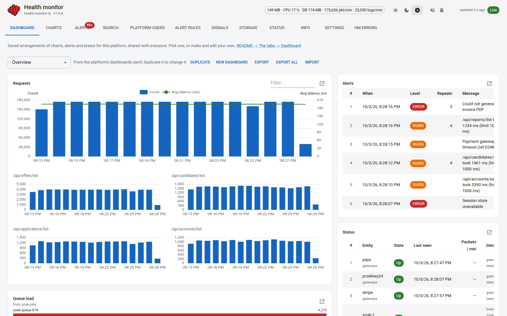

A stand-alone diagnostics server: any platform that emits UDP datagrams in
[protocol v1](#wire-protocol) is monitored — charts, alerts, status and log
search — with no knowledge of that platform in the core.

One Go binary holds the UDP intake, the HTTP/WebSocket API, the SQLite store
and the React SPA. There is nothing else to deploy.

It ingests UDP (protocol v1, or the flat legacy format (v0) through a
configurable adapter), charts it, raises alerts against rules you can edit and
test, lets you silence things deliberately, and keeps searchable logs across
days, behind a login, with a wall-display mode — all of it surviving a
restart. It runs from the binary or from Docker
([Run it with Docker](#run-it-with-docker)).

Open source under the [MIT license](LICENSE):
[github.com/Sznapsollo/health-monitor-nj](https://github.com/Sznapsollo/health-monitor-nj).

## Quick start

Four steps, nothing to configure:

1. **Have Docker** (with Compose) **and make.** Go and Node are not needed:
   everything is built inside Docker.
2. **Clone the repository:**

   ```bash
   git clone https://github.com/Sznapsollo/health-monitor-nj.git
   cd health-monitor-nj
   ```

3. **Start it:**

   ```bash
   make up
   ```

   The first run builds the image, which takes a few minutes.
4. **Open <http://localhost:8081>** and log in with any name and the password
   **`default`**.

Point your senders' UDP at port 8082 on this host. The page reminds you to
change the password until you do. It takes one line in `.env` and another
`make up`. See [Changing the default password](#changing-the-default-password).
To work on the code itself (Go and Node needed), see [Run it](#run-it).

## Contents

- [Quick start](#quick-start)
- [Screenshots](#screenshots)
- [Requirements](#requirements)
- [Run it](#run-it)
- [Run it with Docker](#run-it-with-docker)
  - [First start](#first-start)
  - [Everyday commands](#everyday-commands)
  - [Applying code changes to Docker](#applying-code-changes-to-docker)
  - [What is on the volume](#what-is-on-the-volume)
  - [Your own settings: config.yaml](#your-own-settings-configyaml)
  - [Starting over](#starting-over)
  - [UDP buffers](#udp-buffers)
- [Soak test](#soak-test)
  - [All night in Docker](#all-night-in-docker)
  - [Reading the output](#reading-the-output)
- [The tabs](#the-tabs)
  - [Dashboard](#dashboard)
  - [Charts](#charts)
  - [Alerts](#alerts)
  - [Status](#status)
  - [Search](#search)
  - [Platform users](#platform-users)
  - [Alert rules](#alert-rules)
  - [Signals](#signals)
  - [Storage](#storage)
  - [Info](#info)
  - [Settings](#settings)
  - [HM errors](#hm-errors)
- [The monitor's own state: header, Status tab, HM errors](#the-monitors-own-state-header-status-tab-hm-errors)
- [HTTP and WebSocket](#http-and-websocket)
- [Dashboards](#dashboards)
  - [Filtering a chart panel](#filtering-a-chart-panel)
  - [A platform with no dashboards: the overview](#a-platform-with-no-dashboards-the-overview)
  - [Made from the UI](#made-from-the-ui)
  - [Export and import](#export-and-import)
  - [Copying to another platform](#copying-to-another-platform)
  - [Keeping dashboards safe](#keeping-dashboards-safe)
- [Choosing which charts you see](#choosing-which-charts-you-see)
- [Filters, links and saved sets](#filters-links-and-saved-sets)
  - [The group filter](#the-group-filter)
  - [Two history windows](#two-history-windows)
- [Logging in](#logging-in)
  - [Changing the default password](#changing-the-default-password)
- [Configuration](#configuration)
- [Data and retention](#data-and-retention)
  - [How chart data is stored](#how-chart-data-is-stored)
  - [How long each kind of log is kept](#how-long-each-kind-of-log-is-kept)
  - [Free disk space](#free-disk-space)
- [Alert history](#alert-history)
- [Writing alert rules](#writing-alert-rules)
- [What is in the database](#what-is-in-the-database)
- [Wire protocol](#wire-protocol)
  - [Legacy (v0) packets and mapping.yaml](#legacy-v0-packets-and-mappingyaml)
  - [One request, two ways: what each packet produces](#one-request-two-ways-what-each-packet-produces)
- [Layout](#layout)
- [Signals accepted out of the box](#signals-accepted-out-of-the-box)
- [Info signals: keeping whole reports](#info-signals-keeping-whole-reports)
  - [Try it with soak](#try-it-with-soak)
- [Your own signals, step by step](#your-own-signals-step-by-step)
  - [1. Define the signal](#1-define-the-signal)
  - [2. Put it to use](#2-put-it-to-use)
  - [3. Test it with soak](#3-test-it-with-soak)
- [Conventions](#conventions)
- [License](#license)

## Screenshots

A demo instance fed by `make soak` (with flapping servers) and `loadgen` at
2 500 datagrams a second, about 175 000 packets a minute. Every name, user and
number in them is generated.

**Dashboard.** Requests per minute with the average latency, the busiest URLs,
recent alerts, who is up, and queue load, on one page anyone can arrange
(shown at the top). In dark mode:

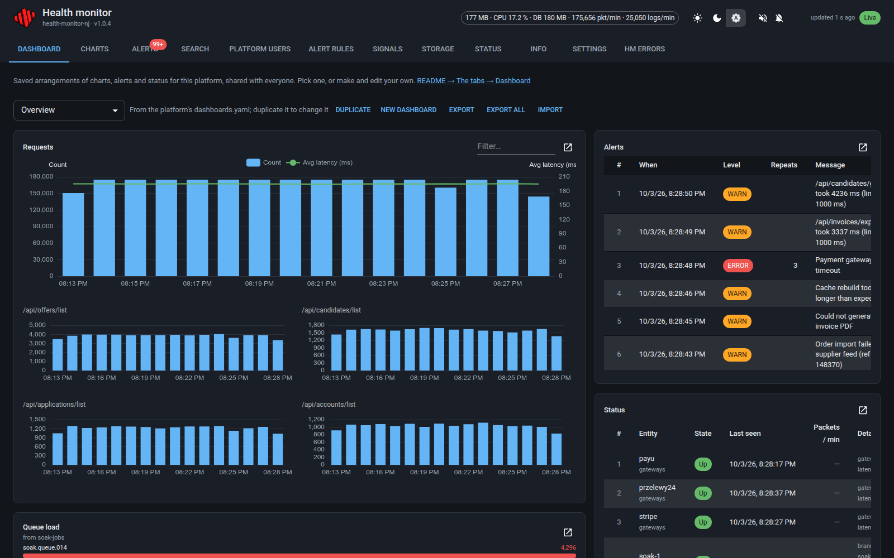

**Charts.** Any chart a signal provides, grouped and filtered on the spot, with
its own history window.

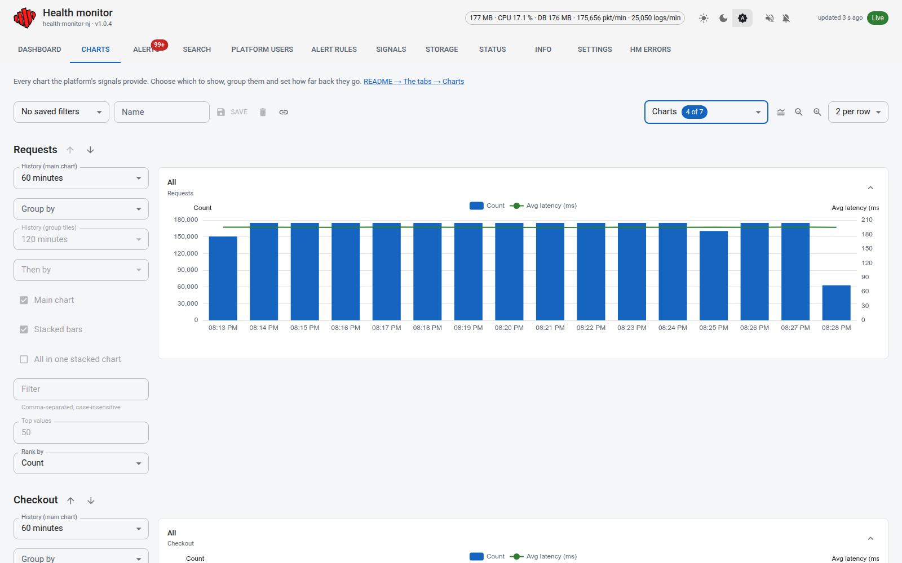

**Alerts.** Raised by senders and by the monitor's own rules, repeats folded
into one row, filtered by level, category or text.

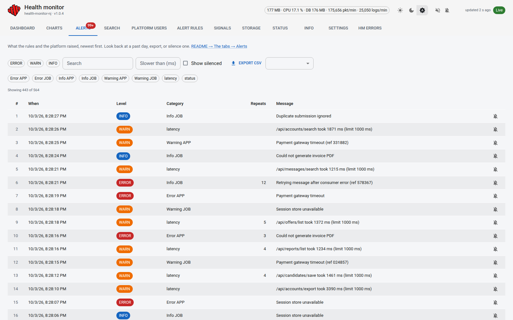

**Search.** Every request and log row, searchable across days.

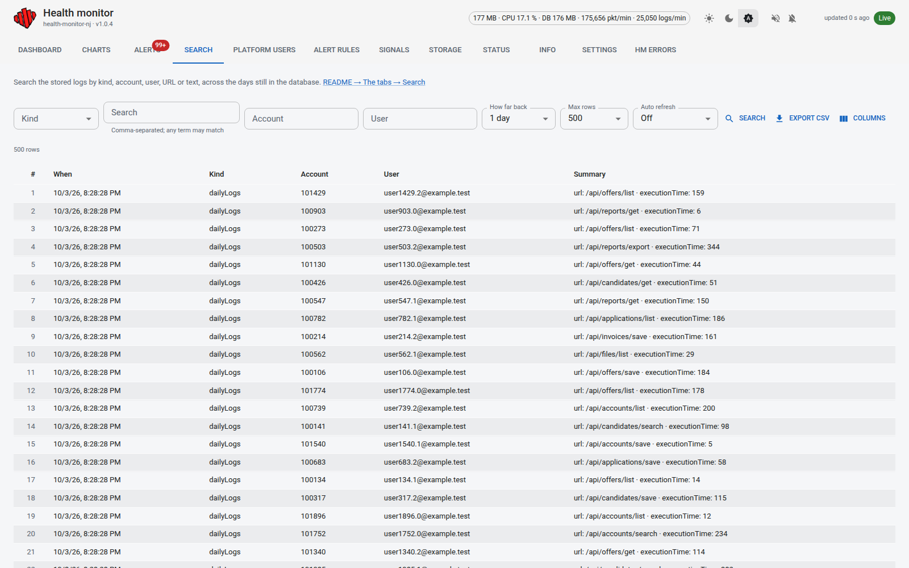

**Platform users.** Who used the platform on a day and how much.

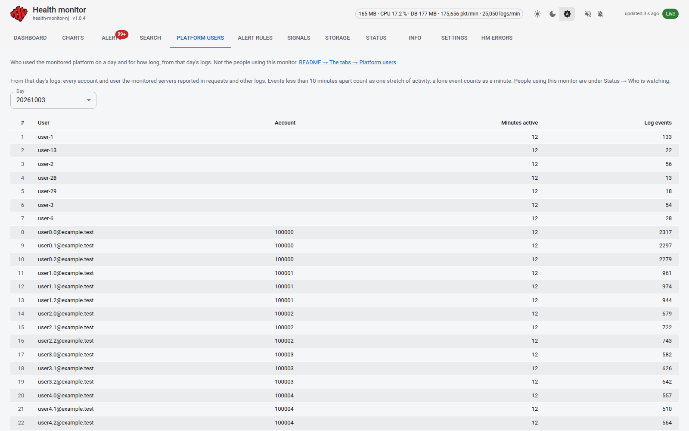

**Alert rules.** Silences that mute or snooze an alert with a reason, and the
latency and offline thresholds, tested against the last hour before saving.

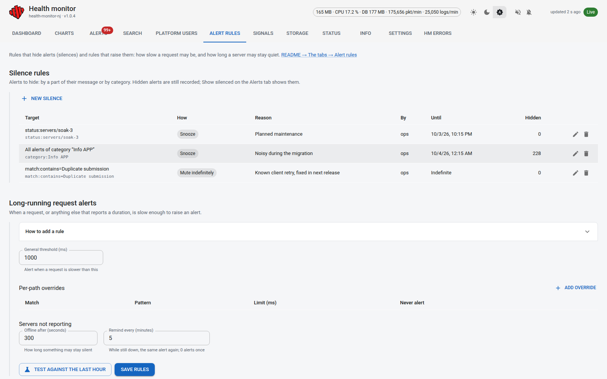

**Signals.** What each signal is and where it came from; new ones are defined
here without a restart.

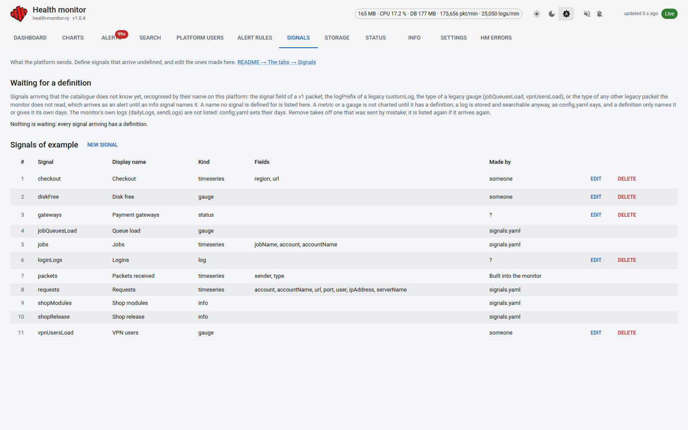

**Status.** Every sender, up or down, with its packets per minute, and what the
monitor itself is using.

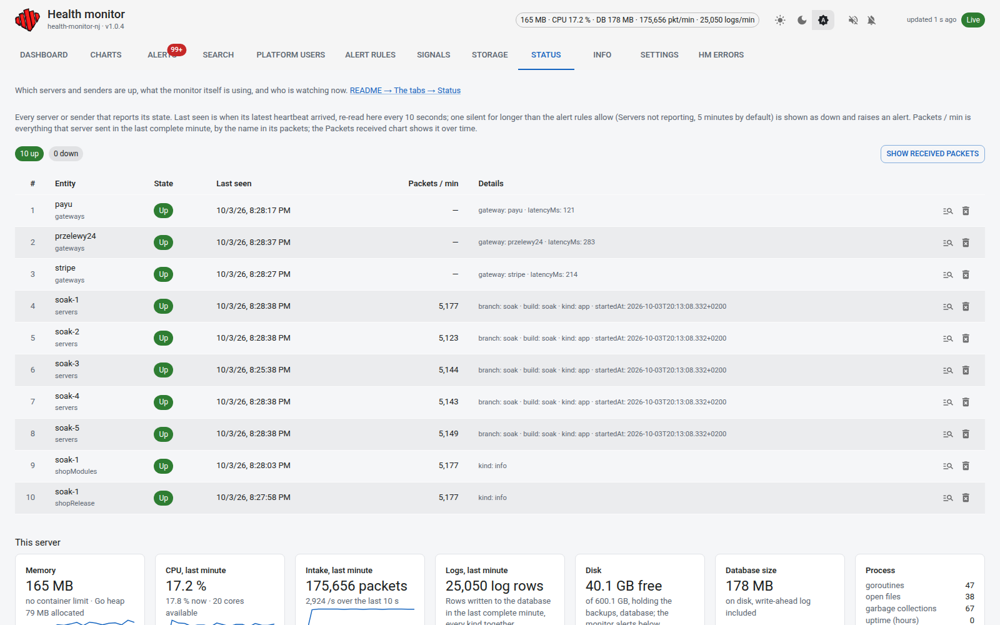

**Info.** Whole reports as senders sent them, merged or kept by version.

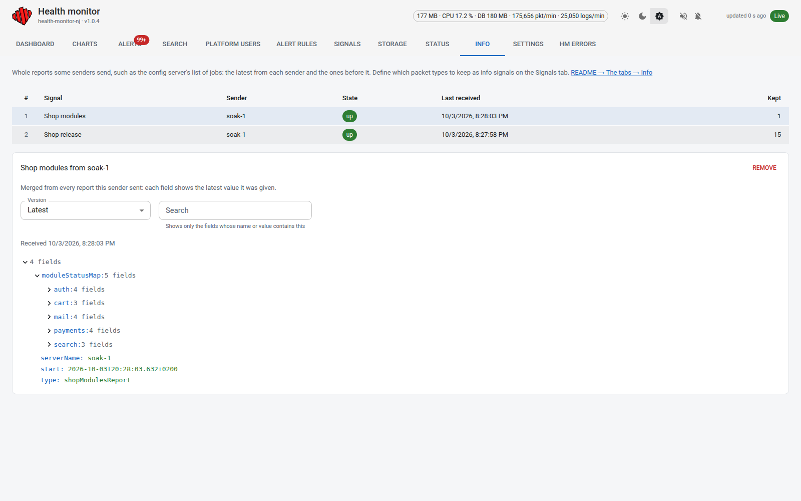

**Storage.** Days held in the database, archives and backups.

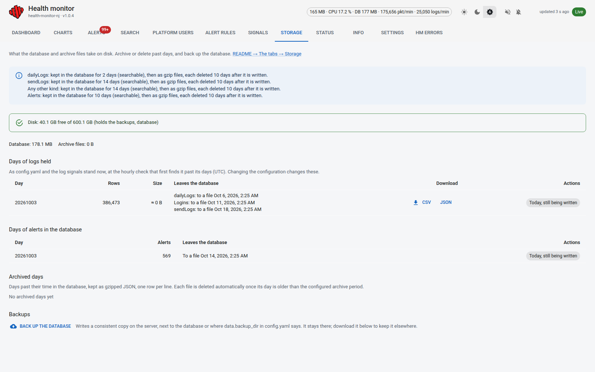

## Requirements

| | version |
|---|---|
| Go | 1.23+ (`go.mod` pins the toolchain; `GOTOOLCHAIN=auto` fetches it) |
| Node | 22+ |
| golangci-lint | optional; `make lint-go` falls back to `go vet` |

## Run it

```bash
make dev        # Go server (HTTP :8081, UDP :8082) + Vite dev server (:5173)
```

Open <http://localhost:5173>. Both halves reload on a change: Vite refreshes
the page, and the server is restarted by `scripts/dev-server.sh` when a `.go`
file or `config.yaml` changes (`make dev-server-once` runs it without the
watcher). That matters because a server left running on older code answers
routes it does not know with the SPA, and the browser then reports a JSON
error rather than "that endpoint does not exist yet".

Files under `platforms/` (signals, rules, dashboards, the mapping) do not
restart it: the running server reloads them itself, as it does in production
and in Docker. Saving a dashboard or a signal from the UI therefore keeps the
page connected.

The defaults are deliberately the **old
monitor's** ports (8081 HTTP, 8082 UDP, 8083 for pprof — its old second HTTP
server), because this replaces it: a dev sender pointed at
`healthCheck.port=8082` reaches the new monitor with no reconfiguration. The
two monitors are never run at the same time in development — stop one, start
the other, and the sender does not change. Ports are still overridable if a
machine needs it, and the Vite proxy follows `HM_HTTP_ADDR`:

```bash
make dev HM_HTTP_ADDR=:8191 HM_UDP_ADDR=:8192 HM_ADMIN_ADDR=127.0.0.1:8193
```

The dev server proxies `/api`, `/healthz` and
`/ws` to the Go process, so the SPA and the API behave as they do in
production, where the SPA is served from the binary itself.

**Two pages, one server.** During `make dev` the page is reachable twice:

| URL | Page served from | Up to date? |
|---|---|---|
| <http://localhost:5173> | Vite, straight from `web/src` | always; reloads on every change |
| <http://localhost:8081> | the Go server, from `web/dist` compiled into it (`web/embed.go`) | only as of the last `make web-build` |

Both talk to the same server, so data is the same; only the page can differ.
`make dev` never rebuilds `web/dist`, so after web changes the 8081 page is
the older one. To bring it up to date:

```bash
make web-build  # rebuilds web/dist from web/src
```

The Go server compiles `web/dist` in when it starts, and the dev watcher does
not look at `web/dist`, so restart `make dev` afterwards (Ctrl-C, then
`make dev`). The 8081 page is what `./bin/hm`, a deployment and the Docker
image serve; rebuild before judging the UI there. During development use
5173.

**When the port is busy.** `make dev` refuses to start when something already
holds the HTTP port (8081), and names it:

```
dev-server: port 8081 is already held by pid 1681022 (/home/…/go-build/…/hm).
dev-server: stop it, or rerun with HM_DEV_TAKEOVER=1 to have it stopped for you.
```

It refuses because a server left over from an earlier session would otherwise
keep answering the new page with old code. Usually that leftover is an
earlier `make dev` whose terminal was closed or killed. To get past it:

```bash
HM_DEV_TAKEOVER=1 make dev   # stops whatever holds the port, then starts as usual
```

`HM_DEV_TAKEOVER=1` sends the holder a normal stop signal (its writers flush),
waits a second and carries on. It stops whatever holds the port, so check the
name in the message first if something else might be using 8081.

A running `make dev` restarts its server whenever a `.go` or `.yaml` file
under `cmd/`, `internal/` or `platforms/` changes, so killing only the server
brings it back on the next change. Stop it with Ctrl-C in its terminal, or
from elsewhere:

```bash
pkill -f scripts/dev-server.sh          # the watcher; it stops its server on the way out
kill -- -$(ps -o pgid= -p $(ss -ltnpH 'sport = :8081' | grep -o 'pid=[0-9]*' | cut -d= -f2) | tr -d ' ')
                                        # a leftover server nothing owns, with its `go run` parent
```

```bash
make web-build  # web/dist only: the page the Go server embeds
make build      # web/dist + bin/hm, one static binary
./bin/hm        # serves everything on :8081
make test       # go test -race ./... and vitest
make lint       # golangci-lint, eslint, prettier, tsc
make gen        # regenerate the protocol schema and TypeScript types
make docker     # the monitor's image only; see "Run it with Docker"
make help       # every target
```

Send it a packet from the shell:

```bash
printf '{"v":1,"t":"metric","signal":"requests","dims":{"url":"/x"},"values":{"count":1,"ms":42}}' \
  | nc -u -w1 127.0.0.1 8082
curl -s "localhost:8081/api/series?signal=requests&group=url&minutes=10"
```

## Run it with Docker

`docker-compose.yml` runs the monitor from its image, with everything it keeps
on a named volume. The image is distroless: the static `hm` binary with the
page built in, no shell.

### First start

```bash
make up                     # or: docker compose up -d --build
```

Open <http://localhost:8081> and log in with any name and the password
`default`. Senders send UDP to port 8082 on this host. Until you set your own
password, the page shows a warning. See
[Changing the default password](#changing-the-default-password).

`.env` (git-ignored) is read by `docker compose` on its own:

| Setting | Default | What it does |
|---|---|---|
| `HM_PASS` | empty, meaning `default` | the dashboard password |
| `HM_OPEN` | empty | `1` runs the monitor with no password, open to anyone who can reach it |
| `HM_HTTP_PORT` | `8081` | host port for the page and the API |
| `HM_UDP_PORT` | `8082` | host port for the UDP intake |
| `SOAK_CONFIG` | `soak.yaml` | the soak profile's traffic file, from the repo root |
| `SOAK_REPORT` | `1m` | how often the soak profile prints a report |

`make dev` uses the same host ports. Stop one before starting the other, or
give Docker other ports in `.env`. If something held a port when the
container started, `docker compose ps` shows an empty PORTS column and the
page does not answer; free the port, then
`docker compose up -d --force-recreate hm`.

### Everyday commands

```bash
docker compose ps                 # running? "healthy" once /healthz answers
docker compose logs -f hm         # the monitor's log (JSON), the full error texts
docker compose restart hm         # restart, keeping everything
docker compose down               # stop and remove the container; the data stays
docker compose up -d              # start again from the image already built
```

`docker compose down -v` also deletes the volume: the database, backups and
every dashboard, signal and rule made in the UI. Use it only to start over.

### Applying code changes to Docker

After changing the code (or `git pull`), one command:

```bash
make up          # the monitor
make up-soak     # the monitor and the soak sender
```

`make up` (`scripts/docker-up.sh`):

1. frees 8081/8082 if a `make dev` server still holds them (stopping it and
   saying so), because Docker would otherwise start the container without
   its ports;
2. builds the image from your working tree, uncommitted changes included,
   while the old container keeps serving;
3. replaces the container (`--force-recreate`) and waits until it is healthy;
4. checks the ports are published and `/healthz` answers, recreating once
   more if not, and otherwise prints the status and the last log lines.

The volume is never touched: data, dashboards, signals and rules stay.
Reload the page afterwards (Ctrl+Shift+R) so the browser takes the new page,
not a cached one.

The same by hand, if you need it:

```bash
# 1. nothing else on the ports: stop make dev (Ctrl-C), check with
ss -ltnup | grep -E ':(8081|8082)\b'
# 2. build, then replace the container
docker compose build
docker compose up -d --force-recreate --wait
# 3. check: PORTS must show 0.0.0.0:8081->8081/tcp and 8082/udp
docker compose ps
curl -i http://localhost:8081/healthz
```

Never add `-v` to `docker compose down` when updating: that deletes the
volume. `make docker` builds only the monitor's image, tagged
`health-monitor-nj:<version>`, for pushing to a registry. The build runs npm
and Go inside Docker, so the host needs neither.

**Switching between `make dev` and Docker.** They use the same ports, so only
one runs at a time. To work in `make dev`: `docker compose stop hm`, then
`make dev`. To go back: Ctrl-C in `make dev`, then `make up`. The two keep
separate data (`./data` for `make dev`, the volume for Docker).

### What is on the volume

The volume `health-monitor-nj_hm-data` is mounted at `/data`:

| Path | What |
|---|---|
| `/data/hm.db` (and `-wal`, `-shm`) | the database: aggregates, logs, alert history, silences, status, logins |
| `/data/hm-backup-*.db` | backups made from the Storage tab |
| `/data/platforms/` | signals, dashboards, rules and the legacy mapping, hot-reloaded |
| `/data/archive/` | archive files of old logs and alerts, unless mapped to a host folder ([below](#your-own-settings-configyaml)) |

On every start, files shipped in the image's `platforms/` are copied onto the
volume **where the volume does not have them yet**. A fresh volume gets the
full set; a later image adds files new to it; nothing already on the volume is
overwritten, so rules, dashboards and signals edited in the UI stay.

#### Changing a platform file for a running container

The container reads the copy **on the volume**, not the one in the repository:
editing `platforms/example/mapping.yaml` (or `signals.yaml`, `rules.yaml`, a
dashboard) in the repository changes nothing in Docker, and neither does
`make up`, because the volume already has the file.

Copy the edited file onto the volume. The monitor watches `/data/platforms`
and reloads signals, rules, dashboards and the legacy mapping within about a
second, with no restart:

```bash
docker compose cp platforms/example/mapping.yaml hm:/data/platforms/example/mapping.yaml
docker compose logs --since 1m hm | grep -i mapping    # "mapping reloaded"
```

A file with a mistake is refused, with the error in the log (for the mapping,
"mapping not reloaded"), and the previous version stays in force.

Or remove the volume's copy and restart; the start copies the repository's
version in again, because it is missing:

```bash
docker run --rm -v health-monitor-nj_hm-data:/data alpine rm /data/platforms/example/mapping.yaml
docker compose restart hm
```

Signals, rules and dashboards can also be changed from the UI, which writes
the volume's copy directly; a file copied in afterwards replaces those changes.

Copying files out, for example a backup:

```bash
docker compose cp hm:/data/hm-backup-20260923-120000.db .
```

### Your own settings: `config.yaml`

The image carries `config.example.yaml` as its settings, at
`/etc/hm/config.yaml` inside the container. **Do not edit
`config.example.yaml` for your own values**: it is the shipped defaults, it
only reaches the container when the image is rebuilt, and your values would be
committed. Give the container a file of your own instead:

1. **Make `config.yaml`** next to `docker-compose.yml`, starting from the
   example (it is git-ignored, so it stays on your machine):

   ```bash
   cp config.example.yaml config.yaml
   ```

   Change only what you need: retention (`log_keep_days`,
   `log_keep_days_by_kind`, `log_archive_keep_days`, `alert_keep_days`,
   `alert_archive_keep_days`), alert windows, the memory cap. Leave the
   container's paths as they are:

   ```yaml
   data:
     dir: "/data"
     platforms_dir: "/data/platforms"
   ```

2. **Mount it** with a `docker-compose.override.yml` next to
   `docker-compose.yml`. `docker compose` merges that file in by itself, and
   `make up` / `scripts/docker-up.sh` use plain `docker compose`, so nothing
   else changes:

   ```yaml
   # docker-compose.override.yml
   services:
     hm:
       volumes:
         - ./config.yaml:/etc/hm/config.yaml:ro
   ```

   It is not git-ignored; add it to `.gitignore` if it should stay local.

3. **Restart**, because settings are read once, at start:

   ```bash
   make up                                   # the first time, or after code changes
   docker restart health-monitor-nj-hm-1     # after changing only config.yaml
   ```

   A plain restart is enough later because the file is mounted, not copied
   into the image. The Storage tab's retention box shows the days in force,
   taken from the running settings, so it is where to check that a change
   took effect.

**The archive in a folder of your own.** Archive files (see
[How long each kind of log is kept](#how-long-each-kind-of-log-is-kept) and
[Alert history](#alert-history)) are written to `/data/archive` inside the
container, which on the host is deep in Docker's volume storage and readable
only by root. For a job that copies them elsewhere, map that one folder to a
normal folder on the host, in the same override:

```yaml
services:
  hm:
    volumes:
      - ./config.yaml:/etc/hm/config.yaml:ro
      - /srv/hm-archive:/data/archive      # a folder on your machine
```

- The monitor runs as user id 65532, so the folder must be writable by it:
  `sudo chown 65532:65532 /srv/hm-archive`, or, for a test folder in your own
  home, `chmod 0777` on it.
- Files are written readable by everyone (mode `0644`), so any user can copy
  them. A file first appears as `*.partial` and is renamed when complete: a
  copier should skip `*.partial`.
- The monitor still deletes each file when its time is up, so copy them out
  within `log_archive_keep_days` / `alert_archive_keep_days`.
- Files already in the volume stay there, hidden by the mapping. To bring them
  along, copy them before restarting (`-p` keeps their times, which their
  deletion counts from):

  ```bash
  docker run --rm -v health-monitor-nj_hm-data:/d:ro -v /srv/hm-archive:/out alpine \
    sh -c 'cp -p /d/archive/*.ndjson.gz /out/'
  ```

The `HM_*` variables in [Configuration](#configuration) win over
`config.yaml`. `HM_PASS` and the published ports already come from `.env`;
any other `HM_*` variable goes under `environment:` in the override:

```yaml
services:
  hm:
    environment:
      HM_LOG_LEVEL: debug
    volumes:
      - ./config.yaml:/etc/hm/config.yaml:ro
```

### Starting over

Two different things, depending on whether the data should survive. Your own
`config.yaml`, `docker-compose.override.yml` and a mapped archive folder are
on the host, outside Docker, so both keep them; both also build a fresh image
from the working tree, with the override applied.

**New image and container, same data.**

```bash
make up
```

The volume is left alone: database, silences, logins, and the signals,
dashboards and rules made in the UI all stay. Shipped platform files the
volume already holds are not replaced; to take a newer one, see
[What is on the volume](#what-is-on-the-volume).

**Everything from scratch.** This deletes the volume, and cannot be undone:

```bash
docker compose down -v      # the container and the hm-data volume
make up                     # new image, empty volume, fresh shipped platform files
```

Keep what you want first:

- **Signals, dashboards and rules made in the UI** live in the volume. Export
  dashboards from the Dashboard tab, or copy the whole folder out:

  ```bash
  docker run --rm -v health-monitor-nj_hm-data:/d:ro -v "$PWD/platforms-backup":/out alpine cp -r /d/platforms /out/
  ```

- **Backups** made on the Storage tab are in the volume too: download them
  first.
- **A mapped archive folder** is not touched; empty it yourself if the
  archive should start over as well.

The password from `.env` still works afterwards; everyone logs in again.

**Old images.** Each `make up` leaves the previous image behind, untagged:

```bash
docker image ls | grep health-monitor-nj   # what is there
docker image prune                          # remove the untagged leftovers
```

Keep `health-monitor-nj:local` (the monitor) and `health-monitor-nj-soak:local`
(used by `make up-soak`); an older tag nothing runs can go with
`docker rmi <image>:<tag>`.

### UDP buffers

The intake asks for an 8 MB receive buffer. Linux caps it at
`net.core.rmem_max`, a host setting a container cannot change. On a busy
host, raise it on the host:

```bash
sudo sysctl -w net.core.rmem_max=8388608
echo 'net.core.rmem_max=8388608' | sudo tee /etc/sysctl.d/90-hm.conf   # after reboots too
```

Kernel drops on the HM errors tab say when this is needed. Docker Desktop runs
containers in its own VM, where the host's setting does not apply; it is fine
for development and soak runs at the default traffic.

## Soak test

`cmd/soak` sends legacy-shaped traffic for hours or days, to see how memory,
database growth and retention hold up. It is not a peak-rate test (that is
`make load`).

Everything a run sends comes from one YAML file; the tool has no built-in
values. `make soak` reads **`soak.yaml`** in the repo root (the Makefile's
`SOAK_CONFIG`), so that file is the complete description of the default run.
A section left out is not sent, and an unknown key is an error. As shipped,
`soak.yaml` sends:

- **Requests:** 25 000/min from five servers, `soak-1`…`soak-5`, on ports
  8080–8084, over 40 urls and a set of accounts. `urlSkew` and
  `accountSkew` set how unevenly they are used: `1` spreads traffic evenly,
  `2` makes a few busier, `4` and up lets a handful dominate. At `2` the
  busiest 1 % of accounts carry about 10 % of the requests; at `4`, about
  32 %.
- **Alerts and sent-mail logs:** about 15/min each.
- **Queue loads:** 15 queues, reported every 5 s.
- **Heartbeats:** from each server every 30 s.
- **Invented v1 signals:** seven, one or more of each type (chart, bars, log,
  status and both kinds of info), listed under `signals:`.

It uses v0 packets and runs until Ctrl-C (`protocol: v0`, `duration: 0s`).

Start a monitor, then the generator:

```bash
make dev                                        # or ./bin/hm, see below
make soak                                       # sends what soak.yaml describes
make soak SOAK_CONFIG=soak.designer.yaml        # another file
```

To stop after a while or drop a server now and then, change `duration:` or
`heartbeats.flap:` in the file (or in a copy passed as `SOAK_CONFIG`).

A day of soak traffic adds millions of rows to the database, so for a long run
give the monitor a data directory of its own instead of your dev `./data`:

```bash
make build
HM_DATA_DIR=/tmp/hm-soak ./bin/hm
cp soak.yaml /tmp/soak-24h.yaml                 # set duration: 24h, heartbeats.flap: true
make soak SOAK_CONFIG=/tmp/soak-24h.yaml
```

### All night in Docker

The easiest long run: the monitor and the sender both in compose, on a volume
of their own, restarting by themselves.

```bash
docker compose --profile soak up -d --build   # the monitor, plus soak sending soak.yaml
docker compose logs -f soak                   # watch it; Ctrl-C leaves it running
```

The next morning:

```bash
docker compose logs soak | tail -20           # the last reports: rates, drops, memory, database size
docker compose logs soak | grep 'monitor: memory' | awk 'NR % 60 == 1'   # one line an hour
docker compose --profile soak stop soak       # stop the traffic, keep the monitor and its data
```

Soak logs in with `HM_PASS` from `.env` to read the counters, and prints a
report every `SOAK_REPORT` (1 min). `SOAK_CONFIG` picks another traffic file;
edit it and run `docker compose --profile soak up -d soak` to restart the
sender with it. What a healthy night looks like: rates on target all night,
zero kernel drops, writer drops and errors; memory levelling off after the
first two hours (the hot window filling up); the database growing by day and
then flat once old days start being dropped.

### Reading the output

Every report (10 s by default, `-report` to change it) prints what was sent
per kind and the rate it reached, then the monitor's own counters from
`/api/state`, and its memory, hot state and database size:

```
07:21:05 [1m0s] sent 25648 · requests 25000 (25004/min) · alerts 15 (18/min) · …
07:21:05   monitor: decoded 50489, legacy 24963, quarantined 0, decode errors 0, too old 0, kernel drops 0 · writer dropped 0, errors 0 · alert writer dropped 0
07:21:05   monitor: memory 80.7 MB, hot state 1.5 MB, database 19.2 MB
```

A healthy run shows zero kernel drops, writer drops, errors and decode errors.
`decoded` is about twice `sent` with v0 packets, because each request also
becomes a searchable `dailyLogs` row. `quarantined` counts only signals the
catalogue does not know yet. Also look at:

- **Charts tab:** "Requests" grouped by Port shows five series.
- **Status table:** the five servers are online. With `flap: true`, one goes
  offline for 7 minutes every 20 and then recovers.
- **Alerts tab:** grouped and ungrouped alerts, plus latency alerts from the
  small share of requests slower than 1 s.
- **Search:** `sendLogs` rows with recipients and subjects.
- **Over hours:** process memory (`/api/metrics`), the size of `hm.db` in
  the data directory, and old days being dropped on schedule.

Flags:

| Flag | Default | What it does |
|---|---|---|
Flags say only which file to read and where to send. Everything else is in
the file:

| Flag | Default | What it does |
|---|---|---|
| `-config` | none, required | the YAML file describing the run; `make soak` passes `$(SOAK_CONFIG)`, which is `soak.yaml` |
| `-addr` | `127.0.0.1:8082` | UDP address of the monitor |
| `-status` | `http://127.0.0.1:8081` | where to read counters back; `""` to skip |
| `-token` | `$HM_SOAK_TOKEN` | login or display token, needed for `-status` once `HM_PASS` is set |
| `-password` | `$HM_PASS`, else `default` | the monitor's password; soak logs in with it when no token is given |
| `-report` | `10s` | how often to print a report |

To change the shape, copy `soak.yaml`, edit it and pass it as `SOAK_CONFIG`
(or `-config`). `soak.yaml` comments every key. Its `signals:` list adds
invented signals (metric, gauge, status, log, alert or info).
`soak.designer.yaml` and `soak.mysignals.yaml` are ready examples; see
[Your own signals, step by step](#your-own-signals-step-by-step).

```yaml
signals:
  - name: checkout
    type: metric
    rate: 600                                  # per minute
    dims: { url: 40, region: [eu, us, asia] }  # a count or a list of values
    values: { ms: [5, 800], count: [1, 3] }    # [min, max]
```

## The tabs

Each tab starts with a one-line hint that links here.

### Dashboard

Saved arrangements of charts, gauges, alerts and status for a platform. Pick
one, or make, edit, duplicate, export and import your own; they are kept on the
server for everyone. See [Dashboards](#dashboards).

### Charts

Every chart the platform's signals provide, for building a view by hand: choose
which to show, group by a dimension, set the history windows, and save the set.
See [Choosing which charts you see](#choosing-which-charts-you-see) and
[Filters, links and saved sets](#filters-links-and-saved-sets).

### Alerts

What the rules and the platform raised, newest first, live or for a past day,
with search, CSV export and a shortcut to silence one. See
[Alert history](#alert-history).

### Status

Every server and sender that reports in and whether it is up, how many packets
each sent in the last minute (from the built-in `packets` signal), the
monitor's own resources, and who is watching right now: one row per open page or wall
screen, with its login (or the wall display's name), browser and system, IP
address, what it is watching, when it connected, when it last spoke to the
monitor, and how many updates it has been sent. The IP address is the one the
monitor sees; in Docker, pages opened on the host itself show Docker's bridge
address, and behind a reverse proxy the proxy's, unless it passes
`X-Forwarded-For`.

**Show received packets**, above the table, opens a window listing every
datagram that arrives while it is open, newest first: when, the sender's IP
address, the sender name (or none), the packet type as sent, the platform and
the size; pick a row to read the packet as it came. **Without a sender only**
finds what the Packets received chart counts as `unknown`; the magnifier on a
row opens it on that sender alone. Nothing goes to disk: the monitor keeps the
last 500 in memory (the first 4 KB of each) only while a window polls for
them, starts empty when one is opened again, and lets go of them about 30
seconds after the last one closes. Wall displays cannot open it.

Below it, **Viewing history** keeps who had the monitor open, a day at a time:
one row per browser tab or wall screen, from when it opened to when it closed,
with the same details, how long it was open, what it watched and how many
updates it was sent. Each tab carries an id through reloads and reconnects,
so a connection that drops and comes back within 5 minutes (a network blip, a
laptop waking up, `make up`) continues the same row and counts as a reconnect.
It costs two small writes per visit and one per open tab a minute. Visits are
kept `data.viewer_history_keep_days` (30) after they end; `0` keeps them. See
[The monitor's own state](#the-monitors-own-state-header-status-tab-hm-errors).

### Search

Free-text search over the stored logs (requests, sent mail, any other kind), by
account, user, URL or text, across the days still in the database. Archived
days are not searched. **Columns** chooses what the table shows and in what order:
the built-in ones (when, kind, account, user, URL, level, summary), any field
found in the results (`ipAddress`, `port`, `emailType`…), or a field typed by
name, for your own logs' properties. Each kind of log keeps its own
columns (and "any kind" its own), in this browser. See
[How long each kind of log is kept](#how-long-each-kind-of-log-is-kept).

### Platform users

Who used the monitored platform on a day and for how long, worked out from that
day's logs and kept for `activity_keep_days` (31), after the logs themselves
are archived. These are the platform's users, not the people using this
monitor; those are under Status. Each pass reads only the log rows added
since the one before, and a finished day is marked done
(`activity_done`), so it is not read again, not even after a restart.

### Alert rules

Two sections: rules that hide alerts, and rules that raise them.

**Silence rules.** Alerts hidden on purpose: what, why, by whom, until when,
and how many alerts each rule has hidden. Make one with **New silence** here,
or with the bell icon on an alert in the Alerts tab, which fills in that
alert's message and category. A silence covers either:

- **Alerts whose message contains** a text: cut the message down to the part
  that stays the same (without times or counts); case does not matter.
- **All alerts of a category**, e.g. every `Warning JOB`.

It lasts until someone removes it (**Mute indefinitely**, the default; a mute
older than a month is flagged for review) or for a set time (**Snooze**). The
reason defaults to "Don't need to see it", so the bell and **Silence** are
enough for a quick one.

The pencil on a silence edits it: what it covers, how long it lasts and why.
It keeps who made it, when, and how many alerts it has hidden; a new snooze
time counts from the moment it is saved.

Silenced alerts, those already listed and those still to come, are hidden from
the list and make no sound or notification. They are still recorded, and **Show
silenced** on the Alerts tab brings them back into view. When a silence is
removed or runs out, the alerts it was hiding show again.

**Long-running request alerts.** The thresholds that raise alerts for a
platform: a general limit and per-URL overrides, tested against the last hour
before they are saved. **Servers not reporting** below them sets how long a
server may stay quiet before it is reported down, and how often to remind
while it stays down (see [Writing alert rules](#writing-alert-rules)). How to add a request rule,
with a full example: see [Writing alert rules](#writing-alert-rules).

### Signals

What the platform sends: signals that arrive undefined can be defined here, and
the ones made here edited or deleted.

A signal counts as undefined when its name has no definition on that
platform. The name is the `signal` field of a v1 packet, the `logPrefix` of a
legacy `customLog`, the type of a legacy gauge (`jobQueuesLoad`,
`vpnUsersLoad`), or the `type` of any other legacy packet the monitor does
not read. Such a packet still arrives as an alert, as it always has, and its
type waits here as a possible **info** signal: **Define** opens an info
signal with that packet type filled in, and from then on its packets are
kept as reports instead. **Show packet** opens what one arrived with, as a tree:
the last packet of a chart or a report type, a gauge's current readings, or
a log's newest stored row. It is read only when asked for; the monitor keeps
one last packet per waiting signal, up to 64 KB. **Remove** takes one off the list when it was sent by
mistake, and it is listed again if it arrives again:

- for a chart, it forgets the sample gathered from its packets and those
  packets' entries under HM errors;
- for a gauge, it drops its current values;
- for a log, it deletes every stored day of it, today's too, after asking.
  The monitor's own logs cannot be removed this way. See
[Your own signals, step by step](#your-own-signals-step-by-step).

A kind of log (a `t: "log"` envelope, or a v0 `customLog` with its
`logPrefix`) can be defined here too. Unlike a chart, it does not need a
definition to work: it is stored, searchable and archived as `config.yaml`
says from its first row. It is listed under its own name, and **Define** asks
only for a display name and how long its days are kept, in the database and
then as gzip files. The monitor's own logs, `dailyLogs` and `sendLogs`, are
not listed: `config.yaml` sets their days. Those two numbers override
`log_keep_days` and `log_archive_keep_days` for that kind; left empty, the
configuration applies. The file is `platforms/<platform>/signals/<kind>.yaml`:

```yaml
kind: log
retention:
  log_days: 5        # searchable in the database
  archive_days: 10   # then a gzip file, deleted 10 days after it is written
display:
  name: API sessions
```

### Storage

What the database and the archive files take on disk, and how much the disk
under them has left. Past days of logs can be
archived early or deleted, archive files downloaded or deleted, freed space
returned to the disk, and the database backed up. Each day in the database
says when it will leave it, per kind of log (to a file, or dropped), and each
archive file when it will be deleted: the first hourly check after the day,
or the file, is past its days, as the configuration stands now. The check
runs when the monitor starts and every hour from then, so a restart moves the
minute. It counts time the machine is awake, so a suspended machine catches
up about an hour of awake time after the last check, and the dates shown
follow that. Days are counted in UTC.

The rows and sizes are not counted on the spot: a finished day is measured
once in the background and kept (`log_table_stats`), today's rows are
counted as they are written, and today's size is worked out from them
(shown with ≈). Right after a restart a day may show "measuring…" for a
moment.

Archiving or deleting a day empties its tables a few thousand rows at a time
before dropping them, so no single step holds the database for long. If a
write still finds the database busy for longer than the busy timeout, the
log, chart and alert writers keep what they could not write and try again
at their next flush, instead of dropping it; what they hold is capped, and
anything given up is counted in the writer stats and logged. See
[How long each kind of log is kept](#how-long-each-kind-of-log-is-kept) and
[What is in the database](#what-is-in-the-database).

### Info

Whole reports that some senders send now and then, such as the config
server's list of jobs and when each last checked in: the latest from each
sender, the ones before it, and whether the sender is still reporting. Pick a
row to read the report as a tree; **Search** keeps only the fields whose name
or value contains the text, and **Version** goes back to an earlier one.
Numbers that are times in milliseconds (a `heartBeat`, say) are shown as a
local time beside them. **Remove** on a report deletes every kept report of
that sender, and its row on the Status tab: test data, or a sender gone for
good. Which packet types are kept is set by info signals on
the Signals tab; see [Info signals: keeping whole reports](#info-signals-keeping-whole-reports).

### Settings

Language, theme, alert sound and browser notifications for this browser, a
message to everyone watching, and display tokens for wall screens. See
[Logging in](#logging-in).

### HM errors

The monitor's own problems: packets it could not place, undefined signals,
decode errors and dropped writes. See
[The monitor's own state](#the-monitors-own-state-header-status-tab-hm-errors).

## The monitor's own state: header, Status tab, HM errors

Beside the title the header shows which build is running (`v1.0.0 · f951f06`,
Go version on hover). The version lives in the `VERSION` file at the root —
bump it there for a release; `make` and the Docker build both read it, and the
commit is stamped beside it (`-dirty` when built from uncommitted changes).

The header shows what the monitor itself costs, always: memory in use and CPU
over the last minute (`83 MB · CPU 3.5 %`), with the Go heap and the cores
available on hover. It turns amber past 80 % of a container memory limit or
of the cores it may use. When a password is set, **Log out** sits at the end
of the header, with the login name on hover.

The **Status** tab shows, below what reports its state:

- **This server:** the same figures with an hour of history as trend lines,
  plus goroutines, open files, garbage collections and uptime
  (`GET /api/server`, `?history=1` for the hour); the intake counters; hot
  state, database size and rows per table; and the counters of each database
  writer (aggregates, logs, alert history, status).
- **Database:** make a backup, and download or delete the backups held.
- **Who is watching:** the open sessions and what each is subscribed to.

In Docker the monitor is the only process in its container, so these are the
container's figures, and a `mem_limit` or `cpus` set in compose shows up as
the limit and the cores.

The **HM errors** tab lists only what hm itself had trouble with. Its badge counts
the problems nobody has marked known yet.

- **One row per kind of problem**, with a count, when it was last seen and
  the last sender. For an unknown signal that means one row per signal name
  and packet type (`checkout`, metric, 1 234 packets), not one row per
  packet. An undefined gauge is listed too (`diskFree`, gauge, with its
  reports), though it is kept rather than quarantined, so defining it charts
  the values already held. Undecodable packets and legacy packets with no adapter get one row
  per problem.
- **Counters** that should stay at zero appear as rows once they are not:
  kernel drops, packets too old to accept, and rows the database writers
  dropped or failed to write.
- **Mark known** (or **Mark all known**) greys a row out and takes it off the
  badge, recording who and when. An unknown signal stays known, and so does
  the choice across restarts. A counter is known only up to the count it had
  when marked: when it grows again it comes back as new, with how many are
  new. **Mark new** undoes it.

The full error text is in the server log; the tab shows what happened and
how often.

## HTTP and WebSocket

| Endpoint | What it is |
|---|---|
| `GET /healthz` | liveness, version, uptime |
| `GET /api/version` | `version` (from `VERSION`), `commit` and `goVersion`; no login needed |
| `GET /api/catalogue` | every platform's signals, dimensions and views — what the UI builds its pickers and tiles from |
| `GET /api/series` | one chart's data: `platform`, `signal`, `minutes`, `group`, `sub`, `top`, `filter`, `sort` |
| `GET /api/state` | hot-state stats, quarantined packets (grouped), intake loss counters |
| `GET /api/server` | the monitor's memory, CPU, goroutines and open files; `history=1` adds the last hour |
| `GET /api/health`, `POST /api/health/known` | the HM errors tab's problem list, how many are new, and marking them known (`{"keys": [...], "known": false}` to make one new again) |
| `GET /api/sessions` | connected viewers |
| `GET /api/metrics` | Prometheus |
| `GET /api/alerts` | the alerts list, filterable; `format=csv` exports it |
| `GET /api/status` | what reports its state, and what has gone quiet |
| `GET /api/silences`, `POST`, `PUT /api/silences/{id}`, `DELETE` | deliberate silences |
| `GET /api/rules`, `PUT`, `POST /api/rules/test` | alert rules, and what a change would have done to the last hour (replayed per URL per minute; a rule that also names an account, user or server is checked where that pair is stored) |
| `GET /api/signals/candidates`, `PUT`, `DELETE /api/signals/{name}` | the signal designer: what arrives undefined, and saving or removing a definition (`platform` in the query) |
| `GET /api/search` | free-text search over stored logs, across days; `format=csv` exports |
| `GET /api/history`, `GET /api/history/{day}` | which days are held, and downloading one |
| `GET /api/activity` | minutes of activity per person per day |
| `POST /api/backup` | copies the database with `VACUUM INTO`; 409 when three are kept or one is being written |
| `GET /api/backups` | the backups kept on the server, newest first, and the `limit` |
| `GET /api/backups/{file}` | downloads one; the server keeps its copy |
| `DELETE /api/backups/{file}` | removes one from the server |
| `POST /api/login`, `POST /api/logout`, `GET /api/session` | name + shared password, answered with a signed cookie |
| `GET/POST /api/display-tokens`, `PUT` (options), `DELETE /api/display-tokens/{id}` | long-lived read-only credentials for wall displays, and how each screen draws itself |
| `GET /api/gauges` | the latest value of every gauge a platform reports |
| `GET /api/dashboards`, `PUT /api/dashboards/{id}`, `DELETE /api/dashboards/{id}` | the arrangements a platform defines; the shipped ones are read-only, the rest are made from the Dashboard tab |
| `POST /api/message` | a line of text pushed to everyone watching |
| `/ws` | live updates: `hello` → `snapshot`, then per flush one `events` message with one entry per chart, carrying every changed minute of it (or, for a client that does not send `batch: true`, one `event` per chart and minute), `alert` as raised, plus `criteria`, `notice` and ping/pong. Each criteria entry has an `id` (default: its signal), so one signal can be watched several ways at once; the snapshot is keyed by it and every event names it. A viewer that cannot keep up for 30 flushes is disconnected so it reconnects with a fresh snapshot |

A request that changes something (anything but `GET`, `HEAD`, `OPTIONS`) and
carries a body must send it as `Content-Type: application/json`, at most
1 MiB (4 KiB for `/api/login`). It is refused when the browser says it came
from another site (`Sec-Fetch-Site: cross-site` or `same-site`) or its
`Origin` is not this host, unless that origin is in `server.allowed_origins`.
Behind a proxy, pass the original `Host` through, as the WebSocket already
requires.

## Dashboards

How the panels are arranged is configuration, like signals and rules — one
file per platform, hot-reloaded, shared by everyone including the wall display:

```yaml
# platforms/example/dashboards.yaml
dashboards:
  ops:
    name: "Operacje"
    default: true
    rows:
      - columns:                   # top row: one full-width column
          - panels:
              - type: chart
                signal: requests   # the main chart plus a tile per url
                group: url
                top: 5
      - columns:                   # second row: two thirds and one third
          - width: 2
            panels:
              - type: gauge
                signal: jobQueuesLoad
                height: 200
          - width: 1
            panels:
              - type: alerts
                levels: [ERROR, WARN]
                limit: 20
              - type: status
```

Rows stack; inside a row, columns sit side by side with relative widths and
stack on a narrow screen. A dashboard with a single `columns:` list and no
`rows:` is read as one row, so older files keep working. Panel types are
`chart`, `gauge`, `alerts` and `status`. A dashboard opens on the **Dashboard**
tab and `?dashboard=ops` links to one; a wall display is paired with one when
its token is made (below). A broken file is refused with a log line and the
previous arrangement stays on screen.

Each chart panel is its own subscription, so two panels may chart `requests`
by different dimensions, and opening a dashboard leaves the Charts tab's own
filters alone.

### Filtering a chart panel

A grouped chart panel can keep only some values, like the Filter field on the
Charts tab: comma-separated, case-insensitive parts of a value or of its name
(`orders, cart` keeps `/api/orders/12` and `/api/cart`).

- **Saved:** `filter` (and `sub_filter` for the then-by grouping) in the
  file, or **Filter** / **Then-by filter** in the panel form. Everyone sees it,
  wall displays included.
- **On the spot:** the small **Filter…** box in the panel's header. It starts
  from the saved filter, applies a moment after you stop typing, and lasts
  until you leave the page; emptying it goes back to the saved filter rather
  than showing everything. It is yours alone: nothing is saved, other viewers
  and wall displays are not affected, and wall displays have no box.

```yaml
- type: chart
  signal: requests
  group: url
  filter: "orders, cart"
```

With a filter set, the main chart counts only what the filter keeps, and its
header says so (`Only "orders, cart"`). Past the signal's `hot_detail_minutes`
those counts come from the database's per-value rows.

### A platform with no dashboards: the overview

A platform with no dashboard of its own, shipped or made in the UI, gets
**Overview**. It is made from the platform's signals rather than stored: every
gauge, then every chart, in a wide column, with the alerts (errors and
warnings) and status in a narrow one beside them. With no chart signal yet, it
charts the built-in `packets` by sender. It follows the signals as they are
defined, is read-only (**Duplicate** it to change it), and a wall display can
be paired with it.

It goes away once the platform has a dashboard of its own, unless a wall
display is paired with it. Then it stays, no longer the default, until that
screen is re-pointed or its token revoked. It cannot be deleted.

### Made from the UI

The Dashboard tab has **New**, **Duplicate**, **Edit** and **Delete**. Editing
adds and removes rows, columns and panels, changes widths, and moves things
by dragging the ⠿ handle on each one:

- a **row** onto another row, to take its place;
- a **column** onto another column (in its row or another row), to take its
  place, or onto a row's empty space, to go last in that row;
- a **panel** onto another panel, to take its place, or onto a column, to go
  last in it, in any row.

The arrow buttons do the same one step at a time, for the keyboard. A panel
form covers the signal, grouping,
filters, top N, history, height, and for alerts the levels, categories and row limit.
A chart panel draws one tile per group value, most active first, up to
**Top N**; left empty it draws only 4, so a quiet sender can be missing from
the tiles even when nothing filters it out.
Save writes `platforms/<platform>/dashboards/<id>.yaml`, one file per
dashboard, and everyone — the wall displays included — sees it within a
second. Each file records `created_by` and `updated_by` from the login name,
shown in the tab; with one shared password that is attribution, not
permission, so anyone logged in can edit any of them.

Those files are ignored by git (`platforms/*/dashboards/`): they are the
running server's data, like the database, and travel with its volume rather
than with the source. To ship one with the code, move it into
`dashboards.yaml`.

Dashboards from `dashboards.yaml` are read-only in the UI: duplicate one to
change it. A dashboard a wall display is paired with cannot be deleted until
the screen is re-pointed or its token revoked. The API is
`PUT /api/dashboards/{id}` and `DELETE /api/dashboards/{id}` (`?platform=`),
behind the login and refused for display tokens; ids are lowercase letters,
digits, `-` and `_`.

### Export and import

**Export** downloads the open dashboard as `dashboard_<name>.json`; **Export
all** downloads every dashboard of the platform as one file,
`dashboards_<platform>.json`. The name is made safe for any file system:
accents become plain letters, anything else unusual becomes `_` ("Anna's
ops (copy)" → `dashboard_Anna_s_ops_copy.json`). The file holds
the arrangement only (name, default flag, rows, columns, panels), not who made
it or which platform it came from, so it can be imported anywhere.

**Import** reads such a file, a single dashboard as `GET /api/dashboards`
returns it, or the older single-row `columns:` form:

- one dashboard opens in the editor, to be looked over and saved;
- several are saved at once, each under a new id when its own is taken.

A panel naming a signal the platform does not define shows "waiting" until
that signal is defined.

### Copying to another platform

With more than one platform, **Copy to platform…** saves the open dashboard on
the platform picked from its list. It keeps the same name, under a new id if
its own is taken there. It is a copy: the two change separately from then on.
Panels refer to signals by name, so they chart there as soon as that platform
defines the same names, and show "waiting" until then. **Open <platform>** in
the confirmation switches to it. The same as exporting here and importing
there.

### Keeping dashboards safe

Dashboards made in the UI are files under the platform's folder, not rows in
the database, so the Storage tab's database backup does not include them. To keep
them:

- **Export all** now and then, and after a change you care about.
- In Docker they live on the volume: `docker compose down` keeps them,
  `docker compose down -v` deletes them with everything else.
- They belong to one platform: `platforms/<platform>/dashboards/`. The page
  opens the default platform (`intake.default_platform`), so after changing
  that name, move the files to the new platform's folder (or use the platform
  switcher, shown when there is more than one).
- Copy them off a Docker volume with
  `docker compose cp hm:/data/platforms/example/dashboards ./dashboards-backup`.

## Choosing which charts you see

The **Charts** menu on the Charts tab picks what the tab shows, in two
sections: **Charts** (time series) and **Current values** (gauges). Nothing
is shown until picked, and a signal defined later is added to the menu
unticked. The page follows the order things were picked in: a newly ticked
one goes last, the arrows beside a chart's title move it up or down, and the
arrows on a current-value tile move it left or right. The choice and its
order are remembered per platform, and **Reset** puts the filters back
without changing either. A chart that is not picked is not merely hidden: it
is left out of the subscription, so the server stops breaking it down and
stops sending it, and the last viewer to untick it releases the dimension
pairs it was keeping precomputed. Whatever the open dashboard draws stays
subscribed either way, so switching tabs is instant.

## Filters, links and saved sets

The filter panel is per signal; what you choose is remembered in this browser
and mirrored into the address bar, so a view can be reloaded or sent to someone.
A saved set carries the picked charts as well as the filters, so it names a
group of charts — which is what a wall display rotating through sets shows.

### The group filter

**Filter** keeps only the group values that contain one of its
comma-separated parts, ignoring case; a value's learned name counts as well as
the value itself. It narrows the tiles and the main chart alike: with a filter
set, the main chart is titled `Only "…"` and counts only what the filter keeps
instead of everything. Without a grouping there is nothing to filter, so the
field is disabled.

### Two history windows

A chart has two windows, set separately in its filters and in a dashboard
panel (`minutes` and `group_minutes` in a dashboard file):

- **History (main chart)**, default 60 minutes: how far back the "All" chart
  reaches. Live, up to the signal's `hot_totals_minutes` (48 h for
  `requests`).
- **History (group tiles)**, default 120 minutes: how far back each tile of
  "Group by" reaches. Live, up to the signal's `hot_detail_minutes`
  (2 h for `requests`); asking for more leaves the older part of the tiles
  empty, and the filter panel says how much is kept.

Both are capped at 1600 minutes and floored at 5. A shorter tile window is
cheaper: the server ranks and sends fewer minutes. To keep tiles longer, raise
the signal's `hot_detail_minutes`, which costs memory in proportion to the
number of distinct dimension values.

| | |
|---|---|
| **Save** | Names the current filters for every signal and applies them. |
| **Load** | The picker to the left; it shows which set is active, including after a reload. |
| **Clear** | Back to what each signal's own definition asks for, and the query string goes away. |
| `?view=<name>` | Opens a saved set **by name**. The name lives in that browser's storage, which is how a wall display is pointed at one: `/?display=1&token=…&view=overnight`. Several names, comma-separated, are the sets a display rotates through. |
| `?signal=requests&group=url&minutes=180&…` | Describes the filters themselves, so the link works in any browser. Editing a filter switches the address bar to this form. |

The copy-link button gives whichever fits: the set's name when one is applied,
the explicit filters when the selection is ad hoc.

## Logging in

Set `HM_PASS` (or `auth.password`). Any name plus that one shared password
gets a signed cookie for seven days; the name is only used to label you in the
sessions list and on "send message". **With no password set, the password is
`default`**, so a fresh clone starts without any setup. Until you change it,
every page shows a warning and the log says so at start. `HM_OPEN=1`
(`auth.open: true`) runs the monitor with no password at all. That is meant
for development, and the log says so plainly at start. `make dev`,
`make dev-server` and `make dev-server-once` set `HM_OPEN=1` for you.

Ten wrong passwords in a minute from one address hold that address off for
the rest of the minute; the address is the connection's, not
`X-Forwarded-For`, so behind a proxy everyone shares one limit. Changing the
password logs every browser out; display tokens keep working.

### Changing the default password

Anyone who can reach the page can log in with `default`. Set your own password
in `.env`, next to `docker-compose.yml` (create it from the example if it is
not there yet):

```bash
cp -n .env.example .env     # only if there is no .env yet
# in .env:
HM_PASS=your-own-password
```

Then restart with it:

```bash
make up                     # or: docker compose up -d
```

Your data is kept. Everyone logs in again with the new password, and the
warning is gone. Without Docker, set `HM_PASS` in the server's environment
or `auth.password` in `config.yaml`, then restart it. The soak sender reads
the same `HM_PASS` from `.env`.

A wall display — a TV or spare monitor with nobody at it — gets its own
credential instead. Settings → *Wall displays* asks for a name **and the
dashboard the screen shows**, then hands you `/?display=1&token=…` once. Point
the screen at it and leave it: no menus, no dialogs, no permission prompts, a
"no connection" warning instead of a silently frozen chart, and a nightly self-reload.

The pairing is stored with the token, so a screen shows the arrangement it was
given and cannot be sent elsewhere by editing the URL in its address bar — and
re-pointing a screen is a change in Settings, not a trip to the wall with a
keyboard. The dashboard has to be one the platform already defines in
`platforms/<platform>/dashboards.yaml`; pairing with anything else is refused
when the token is created. A screen with no pairing (or with no password
configured at all) falls back to the platform's default dashboard, and
`?view=<set>` still puts one on saved filter sets instead, with `&rotate=60`
to cycle through several.

**What else the screen shows** is set per token, when it is made and later on
its row in Settings → *Wall displays*, without a new token or link:

- **System info**: the header badge, with the monitor's memory, CPU, packets
  and log rows per minute.
- **Live status** (on by default): a green "Live · updated 07:41:10" while
  new chart data keeps arriving, or "Live · no new data since 03:12" when the
  screen is connected but the platform has sent nothing for two minutes, at
  night for example. The screen and the monitor exchange a ping every 30
  seconds, so "connected" does not depend on traffic.

  Whatever this says, a screen that has lost the monitor (the connection is
  closed, or nothing at all, not even a ping, has come back for 90 seconds)
  shows an orange "No connection for N min", and reconnects by itself.
- **Theme**: automatic (the screen's own light or dark setting, the default),
  light, dark, or **chosen at the screen**: a light / dark / automatic switch
  appears in the screen's top bar while someone moves the mouse or touches it,
  and fades after ten seconds. It starts on automatic; a choice made there is
  kept in that screen's browser and survives reloads.

A disk running out of space (below `data.min_free_gb`) is shown on every
screen, whatever these say. A screen re-reads its options every minute, so a
change reaches the wall within a minute, without a reload.

The link is shown exactly once: only its hash is stored. Lost it, or retiring
a screen? Revoke the token and make another. A display token can watch the
charts, gauges, alerts, status and the monitor's own figures — and nothing
else: not search, not
sessions, and no action that changes anything.

## Configuration

`config.yaml` (copy `config.example.yaml`), overridden by environment
variables. No file is needed for local development; for Docker, see
[Your own settings: config.yaml](#your-own-settings-configyaml).

| Env | Config key | Default |
|---|---|---|
| `HM_HTTP_ADDR` | `server.http_addr` | `:8081` |
| `HM_UDP_ADDR` | `server.udp_addr` | `:8082` |
| `HM_ADMIN_ADDR` | `server.admin_addr` | `127.0.0.1:8083` (pprof; keep private) |
| `HM_LOG_LEVEL` | `log.level` | `info` |
| `HM_LOG_FORMAT` | `log.format` | `json` |
| `HM_PASS` | `auth.password` | `default` (dashboard password; never commit your own) |
| `HM_OPEN` | `auth.open` | `false` (`1` runs with no password at all) |
| `HM_DATA_DIR` | `data.dir` | `./data` |
| `HM_INTAKE_READERS` | `intake.readers` | `0` = one per CPU |
| `HM_INTAKE_READ_BUFFER_BYTES` | `intake.read_buffer_bytes` | 8 MiB |
| `HM_MAX_PACKET_BYTES` | `intake.max_packet_bytes` | 65536 |

`HM_PLATFORMS_DIR` overrides `data.platforms_dir`, which holds each
platform's catalogue, dashboards and alert rules. Everything else is
`config.yaml` only, including the retention keys below; `config.example.yaml`
carries a comment on each.

## Data and retention

Nothing waits for the end of the day. Aggregates go into one SQLite file under
`data.dir`: each minute is written once when it closes, and the minute still in
progress every **`data.aggregate_flush_every`** (15s), so a row is rewritten a few
times a minute rather than every second. Memory is a cache in front of it, not
the only copy: a crash loses at most those 15 seconds of chart data, and on restart
the hot tiers are refilled from disk rather than coming up blank.

| What | Where it lives | How long | Set by |
|---|---|---|---|
| Per-minute charts, **full breakdown** by dimension | memory | 2 h | `hot_detail_minutes: 120` |
| Per-minute charts, **totals only** | memory | 48 h | `hot_totals_minutes: 2880` |
| Chart data per minute: totals, each dimension's values, kept pairs | SQLite `agg_total`, `agg_dim`, `agg_pair` | totals 30 days; values and pairs 3 days per minute | `durable_days: 30`, `detail_days: 3` |
| Chart data per hour: each dimension's values, kept pairs | SQLite `agg_dim_hour`, `agg_pair_hour` | from `detail_days` to `durable_days` | the same two keys |
| Names of labelled values (`account` → `accountName`) | SQLite `dim_label` | `durable_days` since the name was last seen | `display.labels` |
| Request logs (`dailyLogs`) | SQLite, one table per day | 2 days | `data.log_keep_days_by_kind.dailyLogs` |
| Sent logs (`sendLogs`) and every other `t: "log"` kind | SQLite, one table per day **per kind** | 14 days | `data.log_keep_days` (the default for kinds not named) |
| Days of logs past their time in SQLite | gzip files in `data/archive` | 10 days after the file is written | `data.log_archive_keep_days` (and `_by_kind`) |
| Past alerts and warnings | SQLite `alert_history` | 10 days | `data.alert_keep_days` |
| Days of alerts past that | gzip files in `data/archive` | 10 days after the file is written | `data.alert_archive_keep_days` |
| Per-user activity summary | SQLite `user_activity` | 31 days | `data.activity_keep_days` |
| Gauges (bars): each sender's latest values | memory only | until the sender is silent for 2 min (or `ttl_seconds`); a restart empties them until the next report | `ttl_seconds` |
| Info reports | SQLite `info_entry` | the newest 20 per sender (1 when merged); a silent sender's after 30 days | `retention.versions`, `durable_days` |
| Live alerts | memory | 24 h, or 5000 per platform | not configurable |
| Silences, display tokens, settings | SQLite | until deleted | — |

By kind of signal, in short:

| Kind | Stored | Archived to gzip files | Searchable | Seen on |
|---|---|---|---|---|
| Chart (`timeseries`) | memory (2–48 h) and the shared `agg_*` tables | no; old rows are deleted | no, it is summed per minute | Charts, dashboards |
| Gauge | memory only | no | no | Charts (bars), dashboards |
| Log | its **own** table per day, `log_YYYYMMDD_<kind>`: `dailyLogs`, `sendLogs` and each custom log kind apart | yes, a file per day per kind | yes, Search | Search, Storage |
| Info | `info_entry` | no | no, read as a tree | Info, and Status for up/down unless `no_status` |
| Alerts | `alert_history`, by day | yes, a file per day | yes, the Alerts tab | Alerts |

The first four are **per signal**, in that signal's `retention:` in
`platforms/<platform>/signals.yaml`, and hot-reloaded — no restart. Past 2 h a
minute keeps its totals and loses its breakdown in memory; past 48 h it leaves
memory; past 3 days its per-value rows in the database are summed per hour;
past 30 days everything of it is deleted.

### How chart data is stored

Chart data is stored **per dimension**, the way charts read it, not per full
combination of dimensions. For each signal, every minute holds:

1. **The total:** count, and latency sum/min/max (so averages stay exact).
2. **One row per value of each dimension**, separately: per port, per URL,
   per account, per user. What "Group by: X" draws, one tile per value.
3. **One row per value pair** of the pairs kept: what "Group by: X, then by:
   Y" draws. A pair is kept while a chart shows it, and **always** when the
   signal declares it in `keep_pairs` (for `requests`: port × account and
   server × URL), so those splits have history for times nobody was looking.

Example: five requests in minute 10:15, on ports 8080 (3) and 8081 (2), URLs
`/orders` (4) and `/invoices` (1), accounts acme (3), globex (1), tiny (1):

| table | rows for 10:15 |
|---|---|
| `agg_total` | count 5 |
| `agg_dim` | port 8080: 3 · port 8081: 2 · url /orders: 4 · url /invoices: 1 · account acme: 3 · account globex: 1 · account tiny: 1 |
| `agg_pair` (port × account kept) | 8080/acme: 2 · 8080/globex: 1 · 8081/acme: 1 · 8081/tiny: 1 |

Rows add up across flushes of the same minute, and at most `max_keys` values
per dimension per minute are kept (10 000 for `requests`); the rest go into
one `__other__` row, so totals always add up. After `detail_days` the value
and pair rows of each whole hour are summed into one row per value per hour
(`agg_dim_hour`, `agg_pair_hour`); totals stay per minute.

What this gives and what it does not:

- Every chart the UI can draw: totals, any "Group by", and any "Group by +
  Then by" that was being watched or is in `keep_pairs`.
- A restart refills memory from these tables in a fraction of a second.
- Size grows with the number of distinct values per minute, not with the
  number of requests. Measured at 25 000 requests a minute with 2 000
  accounts and 6 000 users: ~10 000 rows, under 1 MB, per minute.
- Not stored: combinations of three or more dimensions at once, and a new
  two-way split for times before it was watched (unless kept). Each single
  request stays searchable in the request logs for their own retention.

**Upgrading from the older layout** (one `minute_agg` row per full
combination): the first start drops that table, so earlier chart history is
gone, and on a large database the drop takes a while before the server
answers. Starting from an empty data directory (`docker compose down -v`,
after **Export all** of your dashboards) is quicker and gives back the disk
space, which SQLite does not return by itself.

To keep a split's history, add it to the signal's `keep_pairs`:

```yaml
keep_pairs:
  - [port, account]
  - [serverName, url]
```

Each kept pair costs one row per value combination per minute, so prefer
pairs with at least one small dimension (port, server, URL) over pairs of two
large ones (account × user).

Sent logs go the same way as every other log envelope: written as they arrive
rather than buffered for the end of the day, one row per send in that day's
table, with a full-text index over the payload. The Search panel queries them
across days by kind, account, user, URL or free text, and **Storage** downloads
a whole day as JSON or CSV (`/api/history/<day>?format=csv`) — the nearest
thing to the old partial files, except you can also read them without
downloading anything. A day is streamed row by row, so a day of a few hundred
thousand request logs costs the server no more memory than a small one.

### How long each kind of log is kept

Each kind gets **its own table per day** — `log_20260920_sendLogs`,
`log_20260920_dailyLogs` — with its own text index, so one kind's vocabulary
stays out of another's. That is what lets each kind expire on its own clock:
purging is a `DROP TABLE`, never a delete scan.

Two keys decide it. `log_keep_days` is the default for every kind; anything
named in `log_keep_days_by_kind` uses that number instead:

```yaml
# config.yaml
data:
  log_keep_days: 14          # every kind not named below
  log_keep_days_by_kind:
    dailyLogs: 2             # one row per request, so by far the bulkiest
    # sendLogs: 30           # add a line per kind you want to differ
```

**Where to set it.** `config.yaml` only; there is no `HM_*` variable for it,
and it is read at start, so restart after changing it. With `make dev` or
`./bin/hm` that is `config.yaml` in the directory you start from (or
`-config <file>`); for Docker, see
[Your own settings: config.yaml](#your-own-settings-configyaml).

**How it counts.** Once an hour, a day's table leaves the database when its day
is more than N days before today, so `dailyLogs: 2` holds today and the two days
before. `0` is not "keep none": it falls back to `log_keep_days`. To stop
storing request logs at all, set `intake.daily_logs: false` instead.

**Archive files.** A day leaving the database is first written to
`data/archive/logs-<day>-<kind>.ndjson.gz`: gzipped JSON, one row per line,
about a tenth of the space it took in SQLite. The table is dropped only once the
file has been read back and holds every row; otherwise the table stays and the
next hourly run tries again. A file is deleted `log_archive_keep_days` after it
was written (default 10), so a day archived early by hand still gets its full
time as a file:

```yaml
data:
  log_archive_keep_days: 10      # every kind not named below
  log_archive_keep_days_by_kind:
    sendLogs: 10                 # 0 drops this kind instead of archiving it
```

`log_archive_keep_days: 0` drops old days instead of archiving them, for a kind
or for all.
A kind defined as a log signal on the Signals tab keeps its own numbers
instead (see [Signals](#signals)).
Archived days can be downloaded but not searched: `zcat logs-….ndjson.gz | jq`.

The **Storage** tab lists every day still in the database with its rows and
size on disk, and every archive file with its size. A past day can be archived
early or deleted outright (typing its date to confirm); today cannot be touched,
since it is still being written. Archive files can be downloaded or deleted.
Deleting frees space inside the database file at once, and the monitor then
gives it back to the disk in the background; the tab shows how much is still
waiting and has a button to start it by hand.

The kind is whatever the sender puts in `signal` on a `t: "log"` envelope —
`sendLogs`, `dailyLogs`, anything else a platform invents — so the key is that
name, spelled exactly. A kind nobody names simply gets `log_keep_days`, which
is why an unknown kind can never fall through to being kept forever or dropped
at once. The shipped defaults keep 14 days for most things and 2 for
`dailyLogs`, with archive files kept 10 days for every kind.

Unlike the signal catalogues, `config.yaml` is read once at start, so a changed
number needs a restart; after that the hourly rollover applies it at its next
run. A kind with a name that cannot be a table name is spelled safely and given
a short hash, but its rows keep the real name — and the retention key is that
real name, not the table's.

Searching names a kind and reads that kind's tables. Spanning every kind still
works and is still the default in the panel, but it is the expensive path: it
reads one table per kind per day.

A database written before logs were split still has the old shape — one table a
day, `log_YYYYMMDD`, holding every kind. Those are dropped at start: their kind
is unknowable, so per-kind retention cannot be applied to them, and nothing
writes to them any more. The rows in them go with them.

`intake.daily_logs: false` stops the legacy adapter turning each legacy
request into a searchable row, keeping only the charts; a sender that posts
`log` envelopes itself is not affected by it.

Purging is automatic and needs no cron (`cmd/hm/main.go`): memory maintenance
every **30 s**; every **hour**, durable rows past `durable_days`, each kind's
log tables past its own keep-days, alert history past `alert_keep_days`, and
old activity rows.

### Free disk space

Once a minute the monitor asks the operating system how much room is left on
the disk holding the database, and on the one holding the archive (the same
disk unless the archive is mapped elsewhere). Inside Docker that is the host's
disk behind the volume or the mapped folder, so the numbers match `df` on the
host; Docker Desktop on Mac or Windows reports its virtual machine's disk
instead.

Below `data.min_free_gb` (default 10; `0` only measures) it raises an
**ERROR** alert, "disk almost full", once, and an **INFO** alert when the space
is back. The Storage tab shows each disk's free and total space, the Status tab
has a Disk card, and the header badge turns red with the free space while it is
low. Nothing stops writing when the disk is low; the alert is the time to
archive or delete old days, or free space on the host.

## Alert history

Live alerts are a short memory window — 24 hours or 5000 per platform — and a
restart empties it. What is kept is a **durable record beside it**: every alert
is written to `alert_history` as it happens, and the day picker on the Alerts
tab reads it back. The panel draws history exactly as it draws the live list,
because the rows are the same shape.

One row is **one burst**, not one occurrence and not one day. A burst is the
same alert (its `groupKey`, or its category and message) repeating inside the
grouping window, which is a minute by default. Twelve failures at 09:00 and
three more at 17:00 are two rows, counting 12 and 3 — the same collapsing the
live tab does, so nothing merges that the tab would have kept apart. The row
carries the latest message and the worst level the burst reached.

Writing is batched like everything else, about a second behind. The live store
holds the running total for a burst, so a write that never lands is repaired by
the next occurrence; only a burst that never repeats could be lost, and that is
counted rather than passed over — `alertWriter.dropped` in `/api/state`, beside
the other writer stats, is a gap in the record made visible.

After `alert_keep_days` (default 10) each day of alerts, every platform
together, is written to `data/archive/alerts-<day>.ndjson.gz`, one row per
line in the shape above, read back and checked, and only then deleted from the
database. The file is deleted `alert_archive_keep_days` (default 10) after it
was written; `0` deletes old alerts without a file. Alert files are listed on
the Storage tab beside the log files, with their size and the day each will be
deleted. The same tab lists each day of alerts still in the database, with
**Archive** (now, rather than when it ages out) and **Delete** (no file; type
the date to confirm), never for today. Anything that copies `data/archive` elsewhere picks up both kinds.

Heartbeats and silence counters are written the same way: noted in memory on
the packet path, written a second later in one batch (`statusWriter` in
`/api/state`). Nothing that reads a packet ever waits on the database.

One more thing worth knowing: **`state.max_hot_mb` is the memory guard** —
past it the oldest dimension breakdowns are dropped first, totals untouched,
SQLite unaffected. By default it is **on**, sized to fit a container's memory
limit: the process was measured at about 120 MB plus 2.2 × the guard under
heavy load, so the guard is (0.9 × limit − 120 MB) / 2.2 — about 155 MB for a
512 MB container, 365 MB for 1 GB. Without a container limit it is 512 MB (so
up to ~1.2 GB RSS at the plateau). A value in MB overrides that, and `-1`
switches it off. The chosen limit and where it came from are logged at startup,
with a warning below a 384 MB container limit; **512 MB or more is
recommended**. Go's own memory limit is set to 90 % of the container limit
unless `GOMEMLIMIT` is given.

## Writing alert rules

Rules decide when a slow request becomes an alert, and when a quiet server
counts as down. Each platform has one file, `platforms/<platform>/rules.yaml`
(`/data/platforms/<platform>/rules.yaml` in Docker). The **Alert rules** tab
edits it, and a change to the file itself is picked up within seconds.

**What is checked.** Every signal that reports a duration (`requests`, `jobs`,
any metric with an `ms` value) is compared, per minute, with a limit; its
slowest measurement over the limit raises a `latency` alert. Repeats for the
same URL within the grouping window are one row with a count.

**Adding a rule in the tab:**

1. **General threshold (ms):** the limit for everything no override names.
2. **Add override**, then choose how it matches the request URL:
   - **Exact path**: that URL only, e.g. `/api/orders/export`.
   - **Prefix**: every URL starting with it, e.g. `/api/reports/`.
   - **Glob**: a pattern, where `*` stands for one path segment and `**` for
     any number, e.g. `/api/*/search` or `/api/**/export`.
3. Give it a **Limit (ms)**, or tick **Never alert** for URLs that are slow on
   purpose.
4. **Test against the last hour** shows how many alerts the rules would have
   raised, per rule, before anything changes. **Save** applies them at once.

When several overrides match, the most specific wins: an exact path, then the
longest matching prefix, then the first matching glob in the list.

**The same as a file**, with what only the file can do yet: an alert level per
rule, narrowing a rule to one account, user or server, the grouping window,
and phrases that should never raise an alert.

```yaml
# platforms/example/rules.yaml
platform: example
latency:
  default_ms: 1000              # anything slower raises a WARN
  level: WARN
  overrides:
    - path: /api/orders/export  # this one URL may take 10 s
      ms: 10000
    - prefix: /api/reports/     # everything under reports: 5 s, and as an ERROR
      ms: 5000
      level: ERROR
    - glob: /api/*/search       # any resource's search: 3 s
      ms: 3000
    - prefix: /system/grails/logout
      ignore: true              # never alert, however slow
    - prefix: /api/             # one account with heavy data gets 4 s
      account: "100042"         # also: user, serverName
      ms: 4000
offline:
  after_seconds: 300            # a server silent this long is down
  repeat_seconds: 300           # and is alerted again this often while it stays down; 0 = once
groups:
  window_seconds: 60            # repeats within a minute are one row
mute:
  - contains: connection reset by peer  # any alert containing this, any case
    level: WARN                         # optional: only at this level
```

With it, `/api/orders/export` alerts past 10 s, `/api/reports/daily` past 5 s
as an ERROR, `/api/offers/search` past 3 s, and `/api/offers/list` past 1 s,
or past 4 s for account 100042. A rule narrowed to an account is still a
prefix: `/api/reports/` is longer, so it wins for that account too.

**A server that stays down.** After `offline.after_seconds` without a
heartbeat, a server gets one ERROR alert, "app-1 has not reported for 5m0s".
While it stays down, that **same alert** is repeated every
`offline.repeat_seconds` (default 300, five minutes): its message shows how
long it has been quiet ("…for 1h5m"), its repeat count goes up, it moves to the
top of the Alerts tab and plays the sound or notification again, and the alert
history keeps it as one row. When the server reports again the reminders stop
and "app-1 is reporting again" is raised. `repeat_seconds: 0` alerts once, as
before; a silenced server is not reminded. The same two numbers are on the
Alert rules tab, under **Servers not reporting** ("Offline after" in seconds,
"Remind every" in minutes).

A file that does not parse is refused with the error in the log, and the rules
before it stay in force. Saving from the tab rewrites the file, keeping the
file-only settings but not comments.

## What is in the database

One SQLite file, `hm.db` under `data.dir`, in WAL mode — so you can read it
with `sqlite3 -readonly data/hm.db` while the server is running without
blocking it or being blocked. Writing to it while hm runs is not safe; for a
copy to take elsewhere use **Storage → Back up the database** (or
`curl -X POST localhost:8081/api/backup`), which does `VACUUM INTO` and gives
one consistent file, naming what it wrote. Plain `cp hm.db` is not a copy:
committed data sits in `hm.db-wal` until it is checkpointed, so the main file
on its own can be all but empty.

A backup lands beside the live database as `data.dir/hm-backup-YYYYMMDD-HHMMSS.db`,
or in **`data.backup_dir`** when that is set (`/data/archive` puts backups with
the archive files, which in Docker can be a folder on the host; the folder is
created if it is missing, and backups there are never deleted by the archive
rules). It stays there; the Storage tab's **Backups** section lists what is on disk with **Download** and
**Delete** beside each, so a copy can be pulled to your machine then or weeks
later, and old ones cleared out when they are no longer wanted. **At most three
are kept**: with three on disk the button is disabled (and `POST /api/backup`
answers 409) until one is deleted, because each is a full copy on the same disk
as the live database. Nothing prunes them on a timer and nothing moves them off
the box by itself, so treat the button as "make me a consistent file", not as a
backup strategy. A backup is written under a temporary name and renamed when
complete, so an interrupted one never looks like a real one.
A backup is the whole database, `session_secret` included, so it is behind the
login and out of a display token's reach — and worth handling like a
credential once it is on your laptop. **Restoring is manual
and needs no tool**: stop hm, put the backup in place of `hm.db`, delete the
`-wal` and `-shm` beside it, and start again — the hot state refills itself
from what it finds.

Space freed by retention goes back to the disk: the database runs with
`auto_vacuum=INCREMENTAL`, and after each hourly purge and log rollover the
freed pages are returned in small steps, with a pause between them so the
writers are never starved. A database made before this is compacted once, on
the first start of a version that has it (seconds for a couple of GB; skipped
with a warning, and retried on the next start, when the disk has less free
space than twice the live data).

| Table | Holds | Written by | Purged |
|---|---|---|---|
| `agg_total` | One row per signal and minute: the count and latencies of the main chart. | the batched sample writer | per signal, `durable_days` |
| `agg_dim` | One row per signal, minute, dimension and value: what group tiles are drawn from, and what memory is refilled from on restart. | the batched sample writer | per signal, `detail_days`, then summed into `agg_dim_hour` |
| `agg_pair` | One row per signal, minute and value pair of a kept pair. | the batched sample writer | as `agg_dim`, then `agg_pair_hour` |
| `agg_dim_hour`, `agg_pair_hour` | The same per hour, keyed by the hour's first minute. | the hourly roll-up | per signal, `durable_days` |
| `dim_label` | One row per signal and labelled value: the name it last went by and the minute it was last seen (refreshed at most hourly), read back on start. At most 50 000 per dimension. | the batched sample writer | per signal, `durable_days` after it was last seen |
| `log_YYYYMMDD_<kind>` | One row per log entry of that kind on that day — a mail sent, a request handled. The kind is in the table name so each kind expires on its own clock. | the batched log writer | `log_keep_days_by_kind.<kind>`, else `log_keep_days` |
| `log_fts_YYYYMMDD_<kind>` | The full-text index over the table above. External-content FTS5: it holds terms, not a second copy of the text, and points back by rowid. SQLite keeps its own `_config`, `_data`, `_docsize` and `_idx` tables beside it — internals, not data. | the same writer | dropped with its table |
| `alert_history` | One row per **burst** of an alert — the same row the Alerts tab shows, kept so yesterday's can still be read. | the batched alert writer | `alert_keep_days`, then an archive file |
| `user_activity` | Minutes of activity per person per day, the old "user stats", computed from the log rows by the hourly rollover. | the rollover | `activity_keep_days` |
| `status` | The latest heartbeat of everything that reports one: what is online, what has gone quiet, and its last payload. One row per platform, signal and key. | status observations | never; a row is removed by "forget" |
| `silence` | The silences someone created: what is muted, why, by whom, until when, and how much it has suppressed. | the Alert rules tab, Silence rules | no timer; a snooze is deleted as soon as a read finds it expired |
| `log_table_stats` | One row per finished day of each kind of log: its rows and bytes, measured once so the Storage tab never scans a table to show them. | measured in the background once a day is over | with its table |
| `info_entry` | One row per report of an info signal: platform, signal, sender, when it arrived, and the whole packet as JSON; one row per sender for a merged signal. | each info packet | the newest `versions` (20) per sender, or 1 when merged; all of a sender's after `durable_days` (30) of silence |
| `viewer_visit` | One row per browser tab or wall screen that had the monitor open: who, browser, address, watched charts, from, to, reconnects, updates sent. | the live connection | `viewer_history_keep_days` after it ended |
| `display_token` | Wall-display credentials: the hash of each token, the screen's name, and the platform and dashboard it is paired with, and its display options. The secret itself is never stored. | Settings → Wall displays | never; removed by revoking |
| `setting` | Server-side settings, including `session_secret`, the key that signs login cookies. **Anyone who can read this file can forge a login**, so treat the database as a credential. | the server | never |

Some things are deliberately **not** in here. Gauges and the hot minute tiers
are memory only, and so is the live alert window the tab shows by default —
`alert_history` is the record beside it, not the same thing. Rules are a file
(`platforms/<platform>/rules.yaml`), and so are the signal catalogues,
dashboards and the legacy name mapping (`mapping.yaml`), all under
`data.platforms_dir`.

## Wire protocol

One JSON object per datagram (or an array of them for batching):

```json
{"v":1,"t":"metric","signal":"requests","source":"web-1","dims":{"url":"/api/x"},"values":{"count":1,"ms":340}}
{"v":1,"t":"gauge","signal":"queueDepth","points":[{"label":"mail","value":12}]}
{"v":1,"t":"status","signal":"servers","key":"web-1","payload":{"build":"abc123"}}
{"v":1,"t":"alert","level":"WARN","category":"latency","message":"slow","groupKey":"g1"}
{"v":1,"t":"log","signal":"sendLogs","key":"2026-09-18","data":{"to":"a@b.c"}}
```

The Go structs in `internal/protocol` are the single source of truth.
`make gen` derives `schema/hm-protocol-v1.json` from them and
`web/src/protocol.ts` from that; CI fails if either is stale, so the server
and the browser cannot drift.

A `ts` (or legacy `start`) without an offset, such as
`2026-09-18T10:11:12.123`, is read in the server's time zone, so a sender
writing local time should run beside a server set to the same zone (`TZ` in
`.env` for Docker). Alert grouping, offline checks and gauge freshness go by
when a packet arrived, not by its stamp.

### Legacy (v0) packets and `mapping.yaml`

Datagrams without a `v` field are protocol v0, the flat packets older
senders emit. The adapter (`internal/adapter/legacy`) turns them into
v1 envelopes and knows only **native** names:

| | Native names |
|---|---|
| `type` values | `request`, `jobReport`, `customWarning` (also used when `type` is missing), `customLog`, `configServerListStatus`, `configServerJobsListStatus`, `mailServerStatus`, `jobQueuesLoad`, `vpnUsersLoad`; any other type becomes an alert, and waits on the Signals tab to be defined as an info signal |
| fields | `level`, `message`, `groupKey`, `origin`, plus `start`, `executionTime`, `serverName`, `port`, `user`, `account`, `accountName`, `ipAddress`, `url`, … |

What a sender calls these is translated by
**`platforms/<platform>/mapping.yaml`** before the packet is read. For a
sender that calls a request `legacyRequest` and its level `legacyLevel`, it
maps those to `request` and `level`, and sets the word shown after the level
in an alert's category (`Error WEB`, `Warning JOB`):

```yaml
types:   { legacyRequest: request, legacyCustomWarning: customWarning, … }
fields:  { legacyLevel: level, legacyMessage: message, … }
origins: { job: JOB, default: WEB }
```

`internal/adapter/legacy/testdata/mapping.yaml` is a complete example.

`mapping.yaml` is deployment configuration and is **not in the repository**
(`platforms/*/mapping.yaml` is git-ignored). After a fresh clone, create
`platforms/<platform>/mapping.yaml` yourself before building the image or
starting the server; without it legacy packets are read with native names
only. A local `docker compose build` puts the file into the image with the
rest of `platforms/`, and it is seeded onto the volume like the others.

Anything not listed is read as it is, so a sender using the native names needs
no mapping at all (`cmd/soak` and `cmd/loadgen` do). A target that is not a
native name is refused at start. Edits take effect without a restart, and a
broken file keeps the previous mapping. In Docker the file that counts is the
volume's copy; see
[Changing a platform file for a running container](#changing-a-platform-file-for-a-running-container). Without a file, an alert's category
word is the origin in capitals, or `APP` when there is none.

### One request, two ways: what each packet produces

The same request can arrive in either format, and the two do not produce the
same things.

**Legacy (v0):** flat, with no `"v"` field. What older senders emit, and what
soak sends with `protocol: v0`:

```json
{"type":"request","start":"2026-09-24T10:15:03.123+0200","executionTime":142,
 "level":"DEBUG","serverName":"app-1","port":"8080","user":"anna@acme.test",
 "account":"100042","accountName":"Acme","ipAddress":"10.0.0.7","url":"/api/orders"}
```

(A sender with its own names for these fields goes through
[`mapping.yaml`](#legacy-v0-packets-and-mappingyaml) first.) The adapter turns
this one packet into **two**:

1. a **metric** for the charts, signal `requests`, dims `account`, `url`,
   `port` … and values `count: 1`, `ms: 142`;
2. a **log row** for Search, signal `dailyLogs`, with the same fields, while
   `intake.daily_logs` is on (the default), which keeps every request of the
   day searchable.

**v1:** has `"v":1` and a `"t"` saying what it is. The documented format
for new senders:

```json
{"v":1,"t":"metric","platform":"example","signal":"requests","source":"app-1",
 "dims":{"account":"100042","accountName":"Acme","url":"/api/orders","port":"8080",
         "user":"anna@acme.test","ipAddress":"10.0.0.7","serverName":"app-1"},
 "values":{"count":1,"ms":142}}
```

This becomes exactly **one** thing: the metric for the charts. No log row.
A v1 sender that wants requests searchable sends a log packet for them
itself, for every request or only the ones worth finding later:

```json
{"v":1,"t":"log","platform":"example","signal":"dailyLogs","key":"100042",
 "data":{"account":"100042","user":"anna@acme.test","url":"/api/orders","ms":142}}
```

What each costs in the database:

| | Chart data | Log row |
|---|---|---|
| Legacy request | added into that minute's per-value rows; grows with distinct values, not with requests | one row per request, ~440 bytes with its indexes (≈ 9 MB a minute at 25 000 requests a minute), kept `log_keep_days_by_kind.dailyLogs` days |
| v1 metric | the same | none |
| v1 log | — | one row per log packet |

So on a busy legacy platform the request log is most of the database. Turn
it off with `intake.daily_logs: false` (charts are unaffected, Search loses
the per-request rows and the Platform users tab its activity summary), or keep
fewer days of it with `log_keep_days_by_kind: { dailyLogs: 1 }`. Both are
`config.yaml` settings; see
[How long each kind of log is kept](#how-long-each-kind-of-log-is-kept) for
where that file lives in `make dev` and in Docker.

## Layout

```
cmd/hm              the server
cmd/gen-schema      Go structs -> JSON Schema
cmd/loadgen         short fixed-rate burst for the throughput gate (make load)
cmd/soak            long-running realistic traffic (make soak)
internal/api        HTTP: health, metrics, the embedded SPA
internal/config     config.yaml + HM_* overrides
internal/intake     UDP listeners
internal/obs        slog factory + Prometheus collectors
internal/protocol   wire protocol v1 (source of truth)
schema/             generated JSON Schema (committed)
web/                React 19 + TypeScript SPA; web/dist is embedded
platforms/          per-platform signals, dashboards, rules and legacy mapping
docs/               go-primer.md and the specs that follow
```

New to Go? `docs/go-primer.md` covers the handful of idioms this codebase
uses. `docs/protocol-v1.md` is the sender-facing spec and `docs/perf.md` the
measured throughput.

## Signals accepted out of the box

A **signal** is one named stream of packets, such as `requests`. The example
platform (`platforms/example/signals.yaml`) defines these, so their packets
chart as soon as they arrive:

| Signal | Kind | What it is | Grouped by |
|---|---|---|---|
| `requests` | chart (timeseries) | one handled HTTP request | account, account name, URL, port, user, IP, server |
| `jobs` | chart (timeseries) | one consumed queue message, counting its items | job, account, account name |
| `jobQueuesLoad` | bars (gauge) | the current load of each queue | one bar per queue |

Every platform also gets one signal the monitor feeds **itself**:
**`packets`** ("Packets received", listed on the Signals tab as built into the
monitor). Each packet that arrives is counted once, in the minute it arrived,
by **sender** (its `serverName` / `source`; `unknown` without one) and
**type**: the sender's own name for it in v0 (`request`, `customLog`,
`configServerListStatus`…) or kind and signal in v1 (`metric:checkout`,
`status:servers`). A v0 request counts once, even though it also becomes a
`dailyLogs` row. Chart it like any other signal, grouped by sender or type,
to see when a server went quiet or started flooding. It is kept per minute for
a day, then per hour, for 60 days: a few MB. The Status tab shows each
server's last complete minute of it. Packets naming a platform the monitor
does not know are not counted.

Three more kinds of packet need **no definition at all**: alerts (Alerts
tab), status reports (Status tab) and log rows (Search).

Each can arrive as **v1** (has `"v":1`, the documented format) or as a flat
**legacy** packet (no `"v"`), which the legacy adapter translates; see
[One request, two ways](#one-request-two-ways-what-each-packet-produces).
Send any of these to UDP port 8082.

**`requests`**

```json
{"v":1,"t":"metric","platform":"example","signal":"requests","source":"app-1",
 "dims":{"account":"100042","accountName":"Acme","url":"/api/orders","port":"8080",
         "user":"anna@acme.test","ipAddress":"10.0.0.7","serverName":"app-1"},
 "values":{"count":1,"ms":142}}
```
```json
{"type":"request","start":"2026-09-24T10:15:03.123+0200","executionTime":142,
 "level":"DEBUG","serverName":"app-1","port":"8080","user":"anna@acme.test",
 "account":"100042","accountName":"Acme","ipAddress":"10.0.0.7","url":"/api/orders"}
```

**`jobs`**: `count` is how many items the message carried.

```json
{"v":1,"t":"metric","platform":"example","signal":"jobs","source":"jobs-1",
 "dims":{"jobName":"queue - SEND_MAIL","account":"100042","accountName":"Acme"},
 "values":{"count":3,"ms":88}}
```
```json
{"type":"jobReport","start":"2026-09-24T10:15:03.123+0200","jobName":"queue - SEND_MAIL",
 "itemsCount":3,"executionTime":88,"account":"100042","accountName":"Acme"}
```

**`jobQueuesLoad`**: the whole set of bars in every report; `warn` colours a
bar.

```json
{"v":1,"t":"gauge","platform":"example","signal":"jobQueuesLoad","source":"jobs-1",
 "points":[{"label":"mail","value":12},{"label":"invoices","value":1300,"warn":true}]}
```
```json
{"type":"jobQueuesLoad","start":"2026-09-24T10:15:00.000+0200","serverName":"jobs-1",
 "queueLoads":[{"name":"mail","value":12,"warning":false},{"name":"invoices","value":1300,"warning":true}]}
```

**An alert**: shown on the Alerts tab, grouped by `groupKey` when given.

```json
{"v":1,"t":"alert","platform":"example","source":"app-1","level":"ERROR",
 "category":"payments","message":"Payment gateway timeout","groupKey":"gateway"}
```
```json
{"type":"customWarning","start":"2026-09-24T10:15:03.123+0200","level":"ERROR",
 "message":"Payment gateway timeout","serverName":"app-1","origin":"app"}
```

**A status report**: one line per `key` on the Status tab, which goes offline
when the key stops reporting. "Last seen" is when the report **arrived**, not
the time written in it, so a sender whose clock is off, or that sends local
time without a zone, is still reported down on time.

```json
{"v":1,"t":"status","platform":"example","signal":"servers","key":"app-1",
 "payload":{"build":"abc123","startedAt":"2026-09-24T08:00:00Z"}}
```
```json
{"type":"configServerListStatus","start":"2026-09-24T10:15:00.000+0200",
 "serverName":"app-1","build":"abc123","branch":"main","startDate":"2026-09-24T08:00:00.000+0200"}
```

**A log row**: searchable on the Search tab; `signal` is its kind.

```json
{"v":1,"t":"log","platform":"example","signal":"sendLogs","key":"100042",
 "data":{"account":"100042","user":"anna@acme.test","to":"bob@example.test","subject":"Your invoice"}}
```
```json
{"type":"customLog","logPrefix":"sendLogs","start":"2026-09-24T10:15:03.123+0200",
 "account":"100042","user":"anna@acme.test","to":"bob@example.test","subject":"Your invoice"}
```

A packet for a **chart or bars signal nobody defined** is not an error: it
waits on the **Signals** tab (and the HM errors tab) until you define it, which
is the next section.

Try one from a shell:

```bash
printf '{"v":1,"t":"metric","platform":"example","signal":"requests","dims":{"url":"/x","port":"8080"},"values":{"count":1,"ms":42}}' \
  | nc -u -w1 127.0.0.1 8082
```

## Info signals: keeping whole reports

Some packets are neither a chart, a gauge nor an alert: a report a sender
repeats now and then, like the config server's `configServerJobsListStatus`
with every job and when it last checked in. An info signal keeps such a packet
whole, as it arrived, to read on the **Info** tab.

Define one on the **Signals** tab (**New signal**, kind *Info*) by naming the
packet type as the sender sends it, or in a file,
`platforms/<platform>/signals/<name>.yaml`:

```yaml
kind: info
packet_type: configServerJobsListStatus   # the packet's "type", before mapping.yaml
merge: false          # true: one record per sender, every report folded into it
no_status: false      # true: its senders get no row on the Status tab
retention:
  versions: 20        # reports kept per sender; the oldest goes when a new one arrives
  durable_days: 30    # a sender that stops sending is removed after this
display:
  name: Config server jobs
```

- **Merge** (`merge: true`, **Merge reports** on the Signals tab) keeps a
  single record per sender instead of the newest 20, and folds every report
  into it: fields inside objects are merged at every depth, anything else
  takes the newest value, and nothing is removed. It suits a sender that
  sometimes reports everything and sometimes one part, like the config server,
  whose `jobsStatusMap` lists every job with its heartbeat every 95 seconds
  but carries one job with its full `config` when that job registers: merged,
  each job keeps its config and gets its latest heartbeat. A job that
  disappears stays with its last heartbeat, which is how to spot it.
- **One entry per sender**, by the packet's `serverName` (`unknown` when it
  has none), so two config servers keep 20 reports each.
- **Stored in the database** (`info_entry`), so reports survive a restart. At
  one 4 KB report every 95 seconds and 20 kept, a config server takes about
  80 KB, however long it runs.
- **On the Status tab too**: each sender is a row there, and goes down with
  the usual offline alert when its reports stop for longer than
  **Servers not reporting** allows. A report sent rarely, like a daily
  summary, would go down between reports: set `no_status: true` (untick
  **Show on the Status tab**) to keep it on the Info tab only. Saving it so on
  the Signals tab removes the signal's rows from the Status tab; a file edited
  by hand leaves them to be removed there.
- A packet type named by an info signal is kept only there: it is no longer
  read as the heartbeat, alert or log it would otherwise be. Delete the signal
  to go back.
- v1 senders can feed one too: a `t: "status"` envelope for the info signal,
  with the report in `content`.

### Try it with soak

`soak.yaml` and `soak.mysignals.yaml` send two info reports, one of each kind,
as legacy packets from the first server, one a minute:

```yaml
signals:
  - name: shopModules
    type: info
    packetType: shopModulesReport               # the legacy "type" the info signal names
    rate: 1                                     # reports per minute
    partial: true                               # about one report in three carries one module only
    dims: { module: [cart, search, payments, auth, mail] }  # the entries of each report
    values: { queue: [0, 50] }                  # drawn for each entry

  - name: shopRelease
    type: info
    packetType: shopReleaseReport
    rate: 1
    dims: { feature: [newCheckout, darkMode, betaSearch] }
    values: { rollout: [0, 100] }
```

A report lists every value of the first dimension under `<dim>StatusMap`,
each with its `name`, a `heartBeat` and the drawn values, like the config
server's `jobsStatusMap`:

```json
{"type":"shopModulesReport","start":"2026-09-26T19:42:10.000+0200","serverName":"soak-1",
 "moduleStatusMap":{"cart":{"name":"cart","heartBeat":1790437330000,"queue":12}, "...": {}}}
```

With `partial: true`, about one report in three lists one module alone, with a
`config` the full lists leave out. The example platform ships both signals in
`platforms/example/signals.yaml`; on another platform, until they are defined,
their reports arrive as alerts and their packet types wait on the Signals tab.
**Define** them there, or put the files in place:

```yaml
# platforms/example/signals/shopModules.yaml: merged, one record per sender
kind: info
packet_type: shopModulesReport
merge: true
display:
  name: Shop modules
```

```yaml
# platforms/example/signals/shopRelease.yaml: kept whole, the newest 20
kind: info
packet_type: shopReleaseReport
retention:
  versions: 20
display:
  name: Shop release
```

On the Info tab, **Shop modules** shows one record in which each module keeps
the `config` it was last sent alone and the latest `heartBeat` of the full
lists; **Shop release** keeps its last 20 reports to step through with
**Version**. Both senders show on the Status tab too.

## Your own signals, step by step

Anything a sender can put in a packet can become a chart, a set of bars, or
rows you can search: define the signal, put it to use, and test it with soak.
Three examples run through all three steps, all from `soak.mysignals.yaml`:

- **`checkout`**, a **chart**: checkouts per minute with a latency line,
  groupable by region and URL.
- **`diskFree`**, **bars** (a gauge): the current free space of each volume.
- **`loginLogs`**, a **log**: one searchable row per login attempt, saying
  who tried and how it went.

Their packets:

```json
{"v":1,"t":"metric","platform":"example","signal":"checkout","source":"shop-1",
 "dims":{"region":"eu","url":"/cart/pay"},"values":{"count":1,"ms":230}}
```
```json
{"v":1,"t":"gauge","platform":"example","signal":"diskFree","source":"shop-1",
 "points":[{"label":"data","value":212},{"label":"logs","value":48},{"label":"backups","value":390}]}
```
```json
{"v":1,"t":"log","platform":"example","signal":"loginLogs","source":"shop-1",
 "key":"user-7","level":"INFO","data":{"user":"user-7","result":"locked"}}
```

A **chart** signal is a `metric`: each packet is one event (or `count` of
them), with `dims` to group by and a duration in ms for the latency line. A
**bars** signal is a `gauge`: each report replaces the previous values of that
sender, one bar per `label`. A **log** signal is a `log`: each packet is one
row, kept as it is so it can be found again; `user`, `account` and `url` in
its `data` can be searched by name, everything else by free text.

### 1. Define the signal

Until a signal is defined, its packets wait (Signals tab, HM errors tab) and
nothing is charted. Define it in the UI or as a file; both take effect within
a second, with no restart.

**In the UI.** Open the **Signals** tab. Under **Waiting for a definition**,
the arriving signal is listed with the dimensions and values seen so far.
Press **Define**:

- **Kind:** time series (a chart), gauge (bars) or log (searchable rows). A
  log asks only for a display name and how many days its rows are kept, in
  the database and then as gzip files; empty uses `config.yaml`.
- **Dimensions:** the fields to group by; untick what you will not use.
- **Count / duration fields:** which value is the count (`count`) and which
  the duration in ms (`ms`), with a live preview of the main chart.
- **Retention**, **days kept per minute** and **pairs always stored** (see
  [How chart data is stored](#how-chart-data-is-stored)); the defaults are
  fine to start with.

**Save** writes `platforms/<platform>/signals/<name>.yaml`.

**As a file.** The same file, written by hand. It uses exactly the layout the
shipped signals in `platforms/example/signals.yaml` use, so any of those is a
template too.

```yaml
# platforms/example/signals/checkout.yaml
kind: timeseries
input:
  dims: [region, url]
  values: { count: count, ms: ms }   # the packet fields holding count and duration
retention:
  hot_detail_minutes: 120
  hot_totals_minutes: 2880
  durable_days: 30
  detail_days: 3
max_keys: 10000
keep_pairs:
  - [region, url]                    # optional: always store this split
display:
  name: Checkout
  dims: { region: Region, url: URL }
views:
  - { id: all, type: minuteSeries, value: count, style: column, default_on: true,
      options: { secondaryValue: avgMs, secondaryStyle: line } }
  - { id: byGroup, type: minuteSeriesPerGroup, value: count, style: column, top: 10, default_on: true }
```

```yaml
# platforms/example/signals/diskFree.yaml
kind: gauge
ttl_seconds: 120                     # a sender silent this long drops off
display: { name: "Disk free (GB)" }
views:
  - { id: bars, type: barGauge, default_on: true, options: { sort: valueDesc } }
```

```yaml
# platforms/example/signals/loginLogs.yaml
kind: log
retention:
  log_days: 7                        # searchable in the database for 7 days
  archive_days: 10                   # then a gzip file, deleted 10 days after it is written
display:
  name: Logins
```

When a packet carries both an id and a friendly name for it (`account` and
`accountName`), `display.labels` shows the id by its name on chart tiles,
legends and tooltips, while filters and saved views keep working on the id
(either matches a group filter). Both must be declared dims:

```yaml
display:
  labels: { account: accountName }
```

The designer sets the same with **Values named by** on a dimension. Names are learned
from traffic and kept in the database, so they survive a restart; the newest name
wins and shows across the id's whole history. Names from before the labels were
set are not recovered: those ids show bare until they send again.

A gauge needs no dimensions or value fields: the labels and values are in its
points. `sort` is `label`, `labelDesc`, `value` or `valueDesc`. Signals made
in the UI can be edited and deleted there; the shipped ones are read-only
(copy one into `signals/` under a new name to change it).

### 2. Put it to use

A **log** is not drawn: its rows are on the **Search** tab. Once it is defined
(step 1), pick **loginLogs** as the kind; before that, search all kinds. Then type
a user (`user-7`) or any text (`locked`). A day's rows can also be downloaded
from **Storage**. The rest of this step is for charts and bars.

**Charts tab:** tick the signal in the **Charts** menu (a new signal starts
unticked). For `checkout`, set **Group by → Region** for one tile per region,
and **Then by → URL** for stacked bars inside each.

**A dashboard:** open the **Dashboard** tab, **Edit** (or **New**), and on a
column press **+** to add a panel:

- **chart** with signal **Checkout**, **Group by** Region, and the two
  history windows (main chart and group tiles);
- **gauge** with signal **Disk free (GB)**, and **Order** if it should differ
  from the signal's own sort.

**Save** writes `platforms/<platform>/dashboards/<id>.yaml`. The same in a
file:

```yaml
# platforms/example/dashboards/shop.yaml
name: Shop
rows:
  - columns:
      - width: 2
        panels:
          - { type: chart, signal: checkout, group: region, minutes: 180 }
      - width: 1
        panels:
          - { type: gauge, signal: diskFree }
```

### 3. Test it with soak

`soak.yaml` has a `signals:` list: each entry makes soak invent v1 packets of
that shape. Both `soak.yaml`, which `make soak` runs, and
`soak.mysignals.yaml` hold the three examples above (and a second gauge);
`soak.yaml` sends the gauges more often. As in `soak.mysignals.yaml`:

```yaml
signals:
  - name: checkout
    type: metric
    rate: 600                                   # packets per minute
    dims: { url: 40, region: [eu, us, asia] }   # url-1 … url-40, and three fixed regions
    values: { ms: [5, 800], count: [1, 3] }     # latency 5–800 ms; each packet counts 1–3

  - name: diskFree
    type: gauge
    rate: 2                                     # reports per minute
    dims: { volume: [data, logs, backups] }     # one bar per volume
    values: { gb: [0, 500] }                    # each bar drifts between 0 and 500

  - name: loginLogs
    type: log
    rate: 60                                    # log rows per minute
    dims: { user: 30, result: [ok, failed, locked] }  # user-1 … user-30; each row says how it went
```

- `type`: what the packets are for, and where they show:

  | `type` | For | Shows on |
  |---|---|---|
  | `metric` | events to count and time | a chart per minute: Charts tab, dashboards |
  | `gauge` | current values that replace the last ones | bars: Charts tab, dashboards |
  | `status` | "I am alive" from each key (its first dimension's value) | an up/down row on the Status tab, and an offline alert when a key goes quiet |
  | `log` | one row per packet, to find again | Search tab; a table per day, then gzip files |
  | `alert` | a message with a level | Alerts tab |
  | `info` | a whole report, kept as it came; sent as a legacy packet of its `packetType` | Info tab, its sender also on the Status tab unless the signal has `no_status`; see [Info signals](#info-signals-keeping-whole-reports) |

  `soak.yaml` has one of each. Its status example is three payment gateways
  reporting in turn, each a row on the Status tab; stop soak and after 5
  minutes they go down with an offline alert:

  ```yaml
  - name: gateways
    type: status
    rate: 6                                     # reports per minute, the gateways in turn: each every 30 s
    dims: { gateway: [payu, stripe, przelewy24] }  # the keys: one Status row each
    values: { latencyMs: [20, 300] }            # shown with the row
  ```

  A status reports its keys in turn, so each keeps reporting at `rate`
  divided by the number of keys; keep that above one every 5 minutes, or the
  keys go down between reports.
- `dims`: each a count (`url: 40` → `url-1` … `url-40`), a list of values, or
  `{ names: account }` for a name that always goes with that dimension's value
  (`account-17` → `Soak Account 17`), to try `display.labels`. A gauge uses its
  first dimension's values as the bar labels.
- `values`: each a `[min, max]` range; whole ends give whole numbers. A metric
  uses `count` and `ms`; a gauge uses its first range for the bar values. A
  log needs none: its row is its dimensions (plus any values).

Run it against `make dev` or Docker:

```bash
make soak SOAK_CONFIG=soak.mysignals.yaml       # against make dev
SOAK_CONFIG=soak.mysignals.yaml make up-soak    # in Docker
```

Undefined, the signals appear on the Signals tab within a minute (a gauge
after its first report); defined, they chart from the next packet. To try a
shape of your own, copy an entry, rename it and change its dimensions and
ranges.

## Conventions

- Nothing platform-specific in `internal/`: a platform's names and packet
  shapes live in its adapter and its `platforms/` files.
- Every user-facing string goes through `t()`; `en` is the default locale and
  `pl` ships with it. `eslint` fails the build on literal text in JSX.
- No hard-coded colours: `web/src/theme/tokens.ts` is the only place a colour
  is written, and the chart palette is derived from the same tokens.

## License

MIT; see [LICENSE](LICENSE). Security problems: see [SECURITY.md](SECURITY.md).
